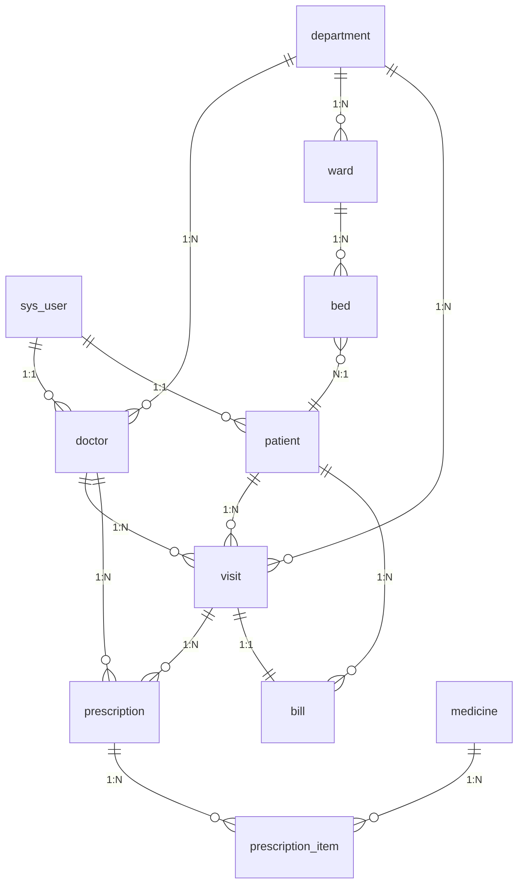

# 医院病人数据管理系统设计文档

## 一、项目概述

本项目是为数据库原理课程设计的大作业，旨在开发一套完整的医院病人数据管理系统，实现医院日常业务的数字化管理。系统围绕病人全生命周期的就医流程，整合了患者信息管理、医生诊疗、药品管理、收费结算等核心业务模块，通过规范化的数据库设计与前后端分离的架构，提升医院的运营效率与数据管理的规范性。

本系统适用于中小型医院的门诊与住院部管理，既满足课程设计中对数据库建模、关系设计、范式应用的教学要求，也具备实际可用的业务功能，可作为完整的课程实践项目进行开发与部署。

## 二、需求分析

### 2.1 角色定义

系统设计了三类用户角色，不同角色拥有不同的权限与功能视图：

1. **系统管理员**：负责系统的整体维护，包括用户管理、科室配置、基础数据维护、数据统计分析等。

2. **医生**：负责接诊患者，管理就诊记录、书写电子病历、开具处方等诊疗相关操作。

3. **患者**：可查看个人就诊记录、处方信息，进行在线挂号等自助操作。

### 2.2 功能需求

#### 2.2.1 用户权限管理

- 支持不同角色的登录与身份验证

- 基于角色的权限控制，确保数据访问安全

- 用户密码加密存储，保障账户安全

#### 2.2.2 基础信息管理

- 科室信息的增删改查与维护

- 医生档案管理，包含职称、所属科室、执业信息等

- 病房与床位信息管理，实时更新床位使用状态

#### 2.2.3 病人信息管理

- 患者基本档案的录入、修改与查询

- 患者既往病史、医保信息的维护

- 患者入院、出院登记流程管理

#### 2.2.4 就诊与病历管理

- 门诊挂号与住院登记

- 就诊记录的全流程跟踪

- 电子病历的书写与归档

- 诊断结果与病情备注管理

#### 2.2.5 药品与处方管理

- 药品基础信息与库存管理

- 医生开具处方功能

- 处方明细的详细记录，包含用法用量

- 处方状态跟踪（未发药 / 已发药）

#### 2.2.6 收费结算管理

- 就诊费用的自动核算

- 账单生成与支付记录

- 支付方式与结算状态管理

#### 2.2.7 数据统计分析

- 患者出入院趋势统计

- 科室接诊量分析

- 药品使用与库存预警

- 可视化报表展示

### 2.3 非功能需求

- 数据一致性：通过数据库外键约束保障数据的完整性，避免脏数据

- 性能：支持百级用户的并发访问，常用查询响应时间小于 1 秒

- 可扩展性：模块化设计，支持后续功能的扩展，如检查检验、远程问诊等

- 易用性：前端界面简洁直观，符合医院工作人员的操作习惯

## 三、系统架构设计

本系统采用主流的**前后端分离**架构，实现前后端解耦，提升开发效率与系统可维护性。

### 3.1 技术选型

|层级|技术选型|说明|
|---|---|---|
|前端层|Vue 3 + Element Plus + Axios + Vue Router|采用 Composition API 开发，使用 Element Plus 提供成熟的后台组件|
|后端层|Spring Boot + MyBatis-Plus + Spring Security|快速开发 RESTful 接口，实现权限控制与数据库操作|
|数据层|MySQL 8.0|关系型数据库，满足关系建模与事务需求|
|认证层|JWT|无状态的用户认证，支持前后端分离的身份验证|
### 3.2 架构流程

1. 用户通过浏览器访问前端应用，前端通过 Axios 向后端发送 API 请求

2. 后端接收到请求后，进行身份验证与权限校验

3. 业务层处理业务逻辑，通过持久层与数据库交互

4. 后端将处理结果以统一的 JSON 格式返回给前端

5. 前端解析结果，渲染页面展示给用户

## 四、功能模块设计

系统整体功能模块划分如下：

```Plain Text

医院病人数据管理系统
├── 系统管理
│   ├── 用户登录/退出
│   ├── 个人信息维护
│   └── 权限控制
├── 基础数据管理
│   ├── 科室管理
│   ├── 医生管理
│   ├── 病房床位管理
│   └── 药品信息管理
├── 病人管理
│   ├── 病人档案管理
│   ├── 入院登记
│   └── 出院办理
├── 诊疗管理
│   ├── 门诊挂号
│   ├── 就诊记录管理
│   ├── 电子病历
│   └── 处方开具
├── 收费管理
│   ├── 账单生成
│   ├── 费用结算
│   └── 支付记录
└── 统计分析
    ├── 就诊数据统计
    ├── 床位使用率分析
    └── 药品库存统计
```

## 五、数据库设计

数据库设计是本系统的核心，严格遵循数据库设计的三大范式，消除数据冗余，保障数据一致性。

### 5.1 概念模型设计（ER 图）

系统的核心实体包括用户、科室、医生、病人、病房、床位、就诊记录、处方、药品、账单等，实体间的关系如下图所示：



#### 核心关系说明

- **一对多关系**：

    - 一个科室包含多名医生，一名医生属于一个科室

    - 一个病房包含多个床位，一个床位属于一个病房

    - 一个病人可以有多次就诊记录，一次就诊记录属于一个病人

    - 一个处方包含多个药品明细，一个明细属于一个处方

- **多对多关系**：

    - 患者与医生的诊疗关系：通过就诊记录表实现，一名医生可以接诊多名患者，一名患者可以被多名医生接诊

    - 患者与医保的关联：支持患者绑定多个医保账户（本系统简化为单医保记录）

### 5.2 逻辑表结构设计

#### 1. 系统用户表 (`sys_user`)

存储所有系统用户的登录信息，统一管理管理员、医生、患者的账户。

|字段名|数据类型|约束|说明|
|---|---|---|---|
|`user_id`|INT|PRIMARY KEY|用户唯一 ID，自增|
|`username`|VARCHAR(50)|UNIQUE|登录用户名|
|`password`|VARCHAR(100)|NOT NULL|加密后的密码|
|`role`|VARCHAR(20)|NOT NULL|用户角色：admin/doctor/patient|
|`status`|TINYINT|DEFAULT 1|账户状态：1 正常 / 0 禁用|
|`create_time`|DATETIME|NOT NULL|创建时间|
#### 2. 科室表 (`department`)

存储医院科室的基础信息。

|字段名|数据类型|约束|说明|
|---|---|---|---|
|`dept_id`|INT|PRIMARY KEY|科室 ID，自增|
|`dept_name`|VARCHAR(50)|NOT NULL|科室名称|
|`phone`|VARCHAR(20)||科室联系电话|
|`manager`|VARCHAR(50)||科室主任|
|`location`|VARCHAR(100)||科室位置|
|`description`|TEXT||科室描述|
#### 3. 医生信息表 (`doctor`)

存储医生的详细档案信息。

|字段名|数据类型|约束|说明|
|---|---|---|---|
|`doctor_id`|INT|PRIMARY KEY|医生 ID，自增|
|`user_id`|INT|FOREIGN KEY|关联系统用户表的用户 ID|
|`dept_id`|INT|FOREIGN KEY|关联科室表的科室 ID|
|`name`|VARCHAR(50)|NOT NULL|医生姓名|
|`gender`|VARCHAR(10)||性别|
|`age`|INT||年龄|
|`title`|VARCHAR(50)||职称：主任医师 / 副主任医师等|
|`license_no`|VARCHAR(50)||执业医师证编号|
|`phone`|VARCHAR(20)||联系电话|
|`email`|VARCHAR(100)||邮箱|
#### 4. 病人信息表 (`patient`)

存储患者的详细档案信息。

|字段名|数据类型|约束|说明|
|---|---|---|---|
|`patient_id`|INT|PRIMARY KEY|患者 ID，自增|
|`user_id`|INT|FOREIGN KEY|关联系统用户表的用户 ID|
|`name`|VARCHAR(50)|NOT NULL|患者姓名|
|`gender`|VARCHAR(10)||性别|
|`birth_date`|DATE||出生日期|
|`id_card`|VARCHAR(18)|UNIQUE|身份证号|
|`phone`|VARCHAR(20)||联系电话|
|`address`|VARCHAR(200)||家庭住址|
|`emergency_contact`|VARCHAR(50)||紧急联系人姓名|
|`emergency_phone`|VARCHAR(20)||紧急联系人电话|
|`insurance_no`|VARCHAR(50)||医保卡号|
|`medical_history`|TEXT||既往病史|
|`admission_date`|DATE||最近入院时间|
#### 5. 病房表 (`ward`)

存储病房的基础信息。

|字段名|数据类型|约束|说明|
|---|---|---|---|
|`ward_id`|INT|PRIMARY KEY|病房 ID，自增|
|`dept_id`|INT|FOREIGN KEY|所属科室 ID|
|`ward_no`|VARCHAR(20)|UNIQUE|病房编号|
|`type`|VARCHAR(20)||病房类型：普通 / ICU/VIP|
|`capacity`|INT|NOT NULL|病房总床位数|
|`used_beds`|INT|DEFAULT 0|已使用床位数|
|`status`|TINYINT|DEFAULT 1|病房状态：1 可用 / 0 停用|
|`description`|VARCHAR(200)||描述|
#### 6. 床位表 (`bed`)

存储床位的详细信息，跟踪床位的使用状态。

|字段名|数据类型|约束|说明|
|---|---|---|---|
|`bed_id`|INT|PRIMARY KEY|床位 ID，自增|
|`ward_id`|INT|FOREIGN KEY|所属病房 ID|
|`bed_no`|VARCHAR(10)||床位号|
|`status`|VARCHAR(20)|NOT NULL|状态：空闲 / 已占用 / 维护中|
|`patient_id`|INT|FOREIGN KEY|当前入住的患者 ID|
|`admission_time`|DATETIME||入住时间|
#### 7. 就诊记录表 (`visit`)

记录患者的每一次就诊 / 住院记录，是诊疗流程的核心表。

|字段名|数据类型|约束|说明|
|---|---|---|---|
|`visit_id`|INT|PRIMARY KEY|就诊 ID，自增|
|`patient_id`|INT|FOREIGN KEY|患者 ID|
|`doctor_id`|INT|FOREIGN KEY|主治医生 ID|
|`dept_id`|INT|FOREIGN KEY|就诊科室 ID|
|`visit_date`|DATETIME|NOT NULL|就诊时间|
|`reason`|VARCHAR(200)||就诊原因|
|`diagnosis`|TEXT||诊断结果|
|`notes`|TEXT||医生备注|
|`status`|VARCHAR(20)|NOT NULL|状态：待就诊 / 就诊中 / 已完成 / 已取消|
#### 8. 药品信息表 (`medicine`)

存储药品的基础信息与库存。

|字段名|数据类型|约束|说明|
|---|---|---|---|
|`medicine_id`|INT|PRIMARY KEY|药品 ID，自增|
|`name`|VARCHAR(100)|NOT NULL|药品名称|
|`specification`|VARCHAR(50)||规格|
|`unit`|VARCHAR(20)||单位：盒 / 片 / 瓶|
|`price`|DECIMAL(10,2)|NOT NULL|单价|
|`stock`|INT|DEFAULT 0|库存数量|
|`manufacturer`|VARCHAR(100)||生产厂家|
|`expiry_date`|DATE||有效期|
#### 9. 处方表 (`prescription`)

存储处方的主信息。

|字段名|数据类型|约束|说明|
|---|---|---|---|
|`prescription_id`|INT|PRIMARY KEY|处方 ID，自增|
|`visit_id`|INT|FOREIGN KEY|关联的就诊记录 ID|
|`doctor_id`|INT|FOREIGN KEY|开方医生 ID|
|`create_time`|DATETIME|NOT NULL|开方时间|
|`status`|VARCHAR(20)|NOT NULL|状态：未发药 / 已发药 / 已过期|
|`notes`|TEXT||处方备注|
#### 10. 处方明细表 (`prescription_item`)

处方的明细项，是处方的弱实体，存储每个药品的用量。

|字段名|数据类型|约束|说明|
|---|---|---|---|
|`item_id`|INT|PRIMARY KEY|明细 ID，自增|
|`prescription_id`|INT|FOREIGN KEY|所属处方 ID|
|`medicine_id`|INT|FOREIGN KEY|药品 ID|
|`quantity`|INT|NOT NULL|数量|
|`price`|DECIMAL(10,2)|NOT NULL|当时的单价（记录历史）|
|`instructions`|VARCHAR(200)||用法说明：每日三次，饭后服用|
#### 11. 收费账单表 (`bill`)

存储患者的收费账单信息。

|字段名|数据类型|约束|说明|
|---|---|---|---|
|`bill_id`|INT|PRIMARY KEY|账单 ID，自增|
|`visit_id`|INT|FOREIGN KEY|关联的就诊记录 ID|
|`patient_id`|INT|FOREIGN KEY|患者 ID|
|`total_amount`|DECIMAL(10,2)|NOT NULL|总金额|
|`pay_amount`|DECIMAL(10,2)|DEFAULT 0|已支付金额|
|`pay_time`|DATETIME||支付时间|
|`pay_method`|VARCHAR(20)||支付方式：现金 / 医保 / 微信|
|`status`|VARCHAR(20)|NOT NULL|状态：未支付 / 已支付 / 已退费|
### 5.3 数据库创建 SQL 脚本

以下是 MySQL 版本的建表语句，可直接执行创建数据库与表结构：

```sql

-- 创建数据库
CREATE DATABASE IF NOT EXISTS hospital_patient_db DEFAULT CHARACTER SET utf8mb4;
USE hospital_patient_db;

-- 1. 系统用户表
CREATE TABLE sys_user (
    user_id INT PRIMARY KEY AUTO_INCREMENT,
    username VARCHAR(50) NOT NULL UNIQUE,
    password VARCHAR(100) NOT NULL,
    role VARCHAR(20) NOT NULL,
    status TINYINT DEFAULT 1,
    create_time DATETIME NOT NULL DEFAULT CURRENT_TIMESTAMP
);

-- 2. 科室表
CREATE TABLE department (
    dept_id INT PRIMARY KEY AUTO_INCREMENT,
    dept_name VARCHAR(50) NOT NULL,
    phone VARCHAR(20),
    manager VARCHAR(50),
    location VARCHAR(100),
    description TEXT
);

-- 3. 医生信息表
CREATE TABLE doctor (
    doctor_id INT PRIMARY KEY AUTO_INCREMENT,
    user_id INT,
    dept_id INT,
    name VARCHAR(50) NOT NULL,
    gender VARCHAR(10),
    age INT,
    title VARCHAR(50),
    license_no VARCHAR(50),
    phone VARCHAR(20),
    email VARCHAR(100),
    FOREIGN KEY (user_id) REFERENCES sys_user(user_id),
    FOREIGN KEY (dept_id) REFERENCES department(dept_id)
);

-- 4. 病人信息表
CREATE TABLE patient (
    patient_id INT PRIMARY KEY AUTO_INCREMENT,
    user_id INT,
    name VARCHAR(50) NOT NULL,
    gender VARCHAR(10),
    birth_date DATE,
    id_card VARCHAR(18) UNIQUE,
    phone VARCHAR(20),
    address VARCHAR(200),
    emergency_contact VARCHAR(50),
    emergency_phone VARCHAR(20),
    insurance_no VARCHAR(50),
    medical_history TEXT,
    admission_date DATE,
    FOREIGN KEY (user_id) REFERENCES sys_user(user_id)
);

-- 5. 病房表
CREATE TABLE ward (
    ward_id INT PRIMARY KEY AUTO_INCREMENT,
    dept_id INT,
    ward_no VARCHAR(20) UNIQUE,
    type VARCHAR(20),
    capacity INT NOT NULL,
    used_beds INT DEFAULT 0,
    status TINYINT DEFAULT 1,
    description VARCHAR(200),
    FOREIGN KEY (dept_id) REFERENCES department(dept_id)
);

-- 6. 床位表
CREATE TABLE bed (
    bed_id INT PRIMARY KEY AUTO_INCREMENT,
    ward_id INT,
    bed_no VARCHAR(10),
    status VARCHAR(20) NOT NULL,
    patient_id INT,
    admission_time DATETIME,
    FOREIGN KEY (ward_id) REFERENCES ward(ward_id),
    FOREIGN KEY (patient_id) REFERENCES patient(patient_id)
);

-- 7. 就诊记录表
CREATE TABLE visit (
    visit_id INT PRIMARY KEY AUTO_INCREMENT,
    patient_id INT,
    doctor_id INT,
    dept_id INT,
    visit_date DATETIME NOT NULL,
    reason VARCHAR(200),
    diagnosis TEXT,
    notes TEXT,
    status VARCHAR(20) NOT NULL,
    FOREIGN KEY (patient_id) REFERENCES patient(patient_id),
    FOREIGN KEY (doctor_id) REFERENCES doctor(doctor_id),
    FOREIGN KEY (dept_id) REFERENCES department(dept_id)
);

-- 8. 药品信息表
CREATE TABLE medicine (
    medicine_id INT PRIMARY KEY AUTO_INCREMENT,
    name VARCHAR(100) NOT NULL,
    specification VARCHAR(50),
    unit VARCHAR(20),
    price DECIMAL(10,2) NOT NULL,
    stock INT DEFAULT 0,
    manufacturer VARCHAR(100),
    expiry_date DATE
);

-- 9. 处方表
CREATE TABLE prescription (
    prescription_id INT PRIMARY KEY AUTO_INCREMENT,
    visit_id INT,
    doctor_id INT,
    create_time DATETIME NOT NULL DEFAULT CURRENT_TIMESTAMP,
    status VARCHAR(20) NOT NULL,
    notes TEXT,
    FOREIGN KEY (visit_id) REFERENCES visit(visit_id),
    FOREIGN KEY (doctor_id) REFERENCES doctor(doctor_id)
);

-- 10. 处方明细表
CREATE TABLE prescription_item (
    item_id INT PRIMARY KEY AUTO_INCREMENT,
    prescription_id INT,
    medicine_id INT,
    quantity INT NOT NULL,
    price DECIMAL(10,2) NOT NULL,
    instructions VARCHAR(200),
    FOREIGN KEY (prescription_id) REFERENCES prescription(prescription_id),
    FOREIGN KEY (medicine_id) REFERENCES medicine(medicine_id)
);

-- 11. 收费账单表
CREATE TABLE bill (
    bill_id INT PRIMARY KEY AUTO_INCREMENT,
    visit_id INT,
    patient_id INT,
    total_amount DECIMAL(10,2) NOT NULL,
    pay_amount DECIMAL(10,2) DEFAULT 0,
    pay_time DATETIME,
    pay_method VARCHAR(20),
    status VARCHAR(20) NOT NULL,
    FOREIGN KEY (visit_id) REFERENCES visit(visit_id),
    FOREIGN KEY (patient_id) REFERENCES patient(patient_id)
);
```

## 六、API 接口设计

系统的接口遵循 RESTful 设计规范，采用统一的请求与响应格式，方便前后端协作开发。

### 6.1 接口通用规范

- **请求前缀**：所有接口均以 `/api/v1` 为前缀，方便后续版本升级

- **请求方法**：

    - `GET`：查询资源

    - `POST`：创建资源

    - `PUT`：更新资源

    - `DELETE`：删除资源

- **统一响应格式**：

```json

{
  "code": 200,
  "message": "success",
  "data": {}
}
```

- `code`：状态码，200 表示成功，非 200 表示错误

- `message`：提示信息

- `data`：业务数据

### 6.2 认证与用户接口

|接口路径|方法|说明|请求参数|
|---|---|---|---|
|`/api/v1/auth/login`|POST|用户登录|`username`: 用户名，`password`: 密码|
|`/api/v1/auth/info`|GET|获取当前用户信息|无（通过 Token 获取）|
|`/api/v1/auth/logout`|POST|用户退出登录|无|
### 6.3 科室与医生接口

|接口路径|方法|说明|
|---|---|---|
|`/api/v1/departments`|GET|获取所有科室列表|
|`/api/v1/departments`|POST|新增科室|
|`/api/v1/departments/{id}`|PUT|修改科室信息|
|`/api/v1/departments/{id}`|DELETE|删除科室|
|`/api/v1/doctors`|GET|获取医生列表|
|`/api/v1/doctors`|POST|新增医生|
|`/api/v1/doctors/{id}`|PUT|修改医生信息|
|`/api/v1/doctors/{id}`|DELETE|删除医生|
### 6.4 病人管理接口

|接口路径|方法|说明|
|---|---|---|
|`/api/v1/patients`|GET|分页查询病人列表|
|`/api/v1/patients`|POST|新增病人档案|
|`/api/v1/patients/{id}`|GET|获取单个病人详情|
|`/api/v1/patients/{id}`|PUT|修改病人信息|
|`/api/v1/patients/{id}`|DELETE|删除病人档案|
|`/api/v1/patients/{id}/visits`|GET|获取病人的就诊记录|
### 6.5 病房与床位接口

|接口路径|方法|说明|
|---|---|---|
|`/api/v1/wards`|GET|获取病房列表|
|`/api/v1/wards/{id}/beds`|GET|获取病房下的床位列表|
|`/api/v1/beds/{id}/occupy`|POST|床位入住登记|
|`/api/v1/beds/{id}/release`|POST|床位出院释放|
### 6.6 就诊与处方接口

|接口路径|方法|说明|
|---|---|---|
|`/api/v1/visits`|POST|新增就诊记录 / 挂号|
|`/api/v1/visits`|GET|查询就诊列表|
|`/api/v1/visits/{id}`|PUT|更新就诊诊断信息|
|`/api/v1/prescriptions`|POST|新增处方|
|`/api/v1/prescriptions/{id}`|GET|获取处方详情（含明细）|
|`/api/v1/prescriptions/{id}/dispense`|POST|处方发药操作|
### 6.7 收费与统计接口

|接口路径|方法|说明|
|---|---|---|
|`/api/v1/bills`|POST|生成账单|
|`/api/v1/bills/{id}/pay`|POST|账单支付|
|`/api/v1/stats/visit-trend`|GET|就诊趋势统计|
|`/api/v1/stats/ward-usage`|GET|床位使用率统计|
|`/api/v1/stats/medicine-stock`|GET|药品库存统计|
## 七、前端页面规划

前端采用单页应用（SPA）架构，根据不同角色展示不同的菜单与页面，参考界面如下：

### 7.1 公共页面

- **登录页**：用户输入用户名密码登录，选择角色

- **个人中心页**：用户修改个人信息与密码

### 7.2 管理员页面

- **控制台首页**：数据概览，展示今日接诊量、床位使用率、待处理账单等核心指标

- **科室管理页**：科室的增删改查

- **医生管理页**：医生档案的维护

- **药品管理页**：药品信息与库存的管理

- **系统用户管理页**：系统账户的维护

### 7.3 医生页面

- **我的患者页**：查看自己接诊的患者列表

- **就诊处理页**：处理患者的就诊，书写诊断，开具处方

- **我的处方页**：查看自己开具的处方记录

### 7.4 患者页面

- **挂号页**：选择科室与医生进行挂号

- **我的就诊记录页**：查看自己的历史就诊记录

- **我的处方页**：查看自己的处方与用药说明

- **我的账单页**：查看自己的账单与支付记录

## 八、开发与部署建议

### 8.1 开发环境

- 数据库：MySQL 8.0

- 后端：JDK 1.8+, Maven 3.6+

- 前端：Node.js 16+, npm 8+

### 8.2 开发流程建议

1. 首先执行数据库脚本，创建数据库与表结构

2. 初始化基础数据：创建管理员账户，导入科室、基础药品数据

3. 开发后端接口，按照模块依次开发认证、基础数据、病人、就诊等接口

4. 开发前端页面，对接后端接口，进行联调

5. 测试各个功能模块，验证数据的一致性与业务流程的正确性

### 8.3 部署建议

- 开发阶段：前后端分别启动，前端配置代理转发后端请求

- 部署阶段：前端打包为静态资源，部署到 Nginx；后端打包为 Jar 包，独立部署

- 数据库建议开启外键约束，保障数据的完整性

## 九、总结

本设计文档完整覆盖了医院病人数据管理系统的需求、架构、数据库设计、接口设计与前端规划，既满足了数据库原理课程对关系建模、范式应用的要求，也提供了一套可直接落地的开发方案。通过该项目的开发，可以深入理解关系型数据库的设计思想，以及前后端分离项目的开发流程，为后续的实际项目开发打下坚实的基础。