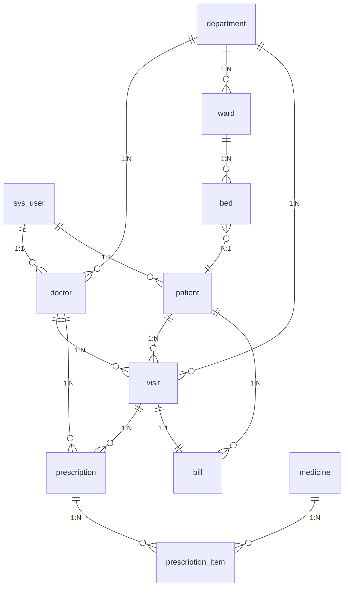

# 智能医院管理系统设计文档

## 一、项目概述

本项目是为数据库原理课程设计的大作业，旨在开发一套完整的智能医院管理系统，实现医院日常业务的数字化管理。系统围绕病人全生命周期的就医流程，整合了患者信息管理、医生诊疗、药品管理、收费结算等核心业务模块，通过规范化的数据库设计与前后端分离的架构，提升医院的运营效率与数据管理的规范性。

本系统适用于中小型医院的门诊与住院部管理，既满足课程设计中对数据库建模、关系设计、范式应用的教学要求，也具备实际可用的业务功能，可作为完整的课程实践项目进行开发与部署。

## 二、需求分析

### 2.1 角色定义

系统设计了三类用户角色，不同角色拥有不同的权限与功能视图：

1. **系统管理员**：负责系统的整体维护，包括用户管理、科室配置、基础数据维护、数据统计分析等。

2. **医生**：负责接诊患者，管理就诊记录、书写电子病历、开具处方等诊疗相关操作。

3. **患者**：可查看个人就诊记录、处方信息，进行在线挂号等自助操作。

### 2.2 功能需求

#### 2.2.1 用户权限管理

- 支持不同角色的登录与身份验证

- 基于角色的权限控制，确保数据访问安全

- 用户密码加密存储，保障账户安全

#### 2.2.2 基础信息管理

- 科室信息的增删改查与维护

- 医生档案管理，包含职称、所属科室、执业信息等

- 病房与床位信息管理，实时更新床位使用状态

#### 2.2.3 病人信息管理

- 患者基本档案的录入、修改与查询

- 患者既往病史、医保信息的维护

- 患者入院、出院登记流程管理

#### 2.2.4 就诊与病历管理

- 门诊挂号与住院登记

- 就诊记录的全流程跟踪

- 电子病历的书写与归档

- 诊断结果与病情备注管理

#### 2.2.5 药品与处方管理

- 药品基础信息与库存管理

- 医生开具处方功能

- 处方明细的详细记录，包含用法用量

- 处方状态跟踪（未发药 / 已发药）

#### 2.2.6 收费结算管理

- 就诊费用的自动核算

- 账单生成与支付记录

- 支付方式与结算状态管理

#### 2.2.7 数据统计分析

- 患者出入院趋势统计

- 科室接诊量分析

- 药品使用与库存预警

- 可视化报表展示

### 2.3 非功能需求

- 数据一致性：通过数据库外键约束保障数据的完整性，避免脏数据

- 性能：支持百级用户的并发访问，常用查询响应时间小于 1 秒

- 可扩展性：模块化设计，支持后续功能的扩展，如检查检验、远程问诊等

- 易用性：前端界面简洁直观，符合医院工作人员的操作习惯

## 三、系统架构设计

本系统采用主流的**前后端分离**架构，实现前后端解耦，提升开发效率与系统可维护性。

### 3.1 技术选型

|层级|技术选型|说明|
|---|---|---|
|前端层|Vue 3 + Element Plus + Axios + Vue Router|采用 Composition API 开发，基于 yudao-ui-admin-vue3 前端框架，使用 Element Plus 提供成熟的后台组件|
|后端层|Spring Boot 2.7 + MyBatis-Plus + Spring Security + RuoYi-vue-pro|基于 RuoYi-vue-pro 企业级快速开发框架，内置 RBAC 权限控制、多租户、代码生成等能力|
|数据层|OpenGauss（华为）|兼容 PostgreSQL 协议的国产企业级关系型数据库，满足关系建模与事务需求|
|缓存层|Redis|缓存用户 Token、权限信息、字典数据，提升接口响应速度|
|认证层|Token + Redis|登录后生成 Token 存入 Redis，后续请求通过 Token 校验身份；支持多租户隔离|
### 3.2 架构流程

1. 用户通过浏览器访问前端应用，前端通过 Axios 向后端发送 API 请求

2. 后端接收到请求后，进行身份验证与权限校验

3. 业务层处理业务逻辑，通过持久层与数据库交互

4. 后端将处理结果以统一的 JSON 格式返回给前端

5. 前端解析结果，渲染页面展示给用户

## 四、功能模块设计

系统整体功能模块划分如下：

```Plain Text

智能医院管理系统
├── 系统管理
│   ├── 用户登录/退出
│   ├── 个人信息维护
│   └── 权限控制
├── 基础数据管理
│   ├── 科室管理
│   ├── 医生管理
│   ├── 病房床位管理
│   └── 药品信息管理
├── 病人管理
│   ├── 病人档案管理
│   ├── 入院登记
│   └── 出院办理
├── 诊疗管理
│   ├── 门诊挂号
│   ├── 就诊记录管理
│   ├── 电子病历
│   └── 处方开具
├── 收费管理
│   ├── 账单生成
│   ├── 费用结算
│   └── 支付记录
└── 统计分析
    ├── 就诊数据统计
    ├── 床位使用率分析
    └── 药品库存统计
```

## 五、数据库设计

数据库设计是本系统的核心，严格遵循数据库设计的三大范式，消除数据冗余，保障数据一致性。

### 5.1 概念模型设计（ER 图）

系统的核心实体包括用户、科室、医生、病人、病房、床位、就诊记录、处方、药品、账单等，实体间的关系如下图所示：


```mermaid
erDiagram
    sys_user ||--o{ doctor : "1:1"
    sys_user ||--o{ patient : "1:1"
    department ||--o{ doctor : "1:N"
    department ||--o{ ward : "1:N"
    department ||--o{ visit : "1:N"
    ward ||--o{ bed : "1:N"
    bed }o--|| patient : "N:1"
    patient ||--o{ visit : "1:N"
    patient ||--o{ bill : "1:N"
    doctor ||--o{ visit : "1:N"
    doctor ||--o{ prescription : "1:N"
    visit ||--o{ prescription : "1:N"
    visit ||--|| bill : "1:1"
    prescription ||--o{ prescription_item : "1:N"
    medicine ||--o{ prescription_item : "1:N"
```

#### 核心关系说明

- **一对多关系**：

    - 一个科室包含多名医生，一名医生属于一个科室

    - 一个病房包含多个床位，一个床位属于一个病房

    - 一个病人可以有多次就诊记录，一次就诊记录属于一个病人

    - 一个处方包含多个药品明细，一个明细属于一个处方

- **多对多关系**：

    - 患者与医生的诊疗关系：通过就诊记录表实现，一名医生可以接诊多名患者，一名患者可以被多名医生接诊

    - 患者与医保的关联：支持患者绑定多个医保账户（本系统简化为单医保记录）

### 5.2 逻辑表结构设计

#### 1. 系统用户表 (`system_users`)

由 RuoYi-vue-pro 框架内置提供，存储所有系统用户的登录信息，统一管理管理员、医生、患者的账户。

|字段名|数据类型|约束|说明|
|---|---|---|---|
|`id`|BIGINT|PRIMARY KEY|用户唯一 ID|
|`username`|VARCHAR(30)|UNIQUE|登录用户名|
|`password`|VARCHAR(100)|NOT NULL|BCrypt 加密后的密码|
|`nickname`|VARCHAR(30)|NOT NULL|用户昵称|
|`status`|SMALLINT|DEFAULT 0|账户状态：0 正常 / 1 禁用|
|`tenant_id`|BIGINT|NOT NULL|所属租户 ID|
|`create_time`|TIMESTAMP|NOT NULL|创建时间|

> 注：角色通过 RBAC 角色表（`system_role`）管理，用户与角色通过 `system_user_role` 关联，不在本表中以字段形式存储。
#### 2. 科室表 (`hospital_department`)

存储医院科室的基础信息。

|字段名|数据类型|约束|说明|
|---|---|---|---|
|`id`|BIGINT|PRIMARY KEY|科室 ID（序列生成）|
|`dept_name`|VARCHAR(50)|NOT NULL|科室名称|
|`phone`|VARCHAR(20)||科室联系电话|
|`manager`|VARCHAR(50)||科室主任|
|`location`|VARCHAR(100)||科室位置|
|`description`|TEXT||科室描述|
|`creator`|VARCHAR(64)|DEFAULT ''|创建者|
|`create_time`|TIMESTAMP|NOT NULL|创建时间|
|`updater`|VARCHAR(64)|DEFAULT ''|更新者|
|`update_time`|TIMESTAMP|NOT NULL|更新时间|
|`deleted`|SMALLINT|DEFAULT 0|逻辑删除标记：0 正常 / 1 已删除|
|`tenant_id`|BIGINT|NOT NULL|租户编号|
#### 3. 医生信息表 (`hospital_doctor`)

存储医生的详细档案信息。

|字段名|数据类型|约束|说明|
|---|---|---|---|
|`id`|BIGINT|PRIMARY KEY|医生 ID（序列生成）|
|`user_id`|BIGINT||关联系统用户表的用户 ID|
|`dept_id`|BIGINT||关联科室表的科室 ID|
|`name`|VARCHAR(50)|NOT NULL|医生姓名|
|`gender`|VARCHAR(10)||性别（字典值：1男/2女）|
|`age`|INT||年龄|
|`title`|VARCHAR(50)||职称（字典值：1主任医师/2副主任医师/3主治医师/4住院医师）|
|`license_no`|VARCHAR(50)||执业医师证编号|
|`phone`|VARCHAR(20)||联系电话|
|`email`|VARCHAR(100)||邮箱|
|`creator`|VARCHAR(64)|DEFAULT ''|创建者|
|`create_time`|TIMESTAMP|NOT NULL|创建时间|
|`updater`|VARCHAR(64)|DEFAULT ''|更新者|
|`update_time`|TIMESTAMP|NOT NULL|更新时间|
|`deleted`|SMALLINT|DEFAULT 0|逻辑删除标记|
|`tenant_id`|BIGINT|NOT NULL|租户编号|
#### 4. 病人信息表 (`hospital_patient`)

存储患者的详细档案信息。

|字段名|数据类型|约束|说明|
|---|---|---|---|
|`id`|BIGINT|PRIMARY KEY|患者 ID（序列生成）|
|`user_id`|BIGINT||关联系统用户表的用户 ID|
|`name`|VARCHAR(50)|NOT NULL|患者姓名|
|`gender`|VARCHAR(10)||性别（字典值：1男/2女）|
|`birth_date`|DATE||出生日期|
|`id_card`|VARCHAR(18)||身份证号|
|`phone`|VARCHAR(20)||联系电话|
|`address`|VARCHAR(200)||家庭住址|
|`emergency_contact`|VARCHAR(50)||紧急联系人姓名|
|`emergency_phone`|VARCHAR(20)||紧急联系人电话|
|`insurance_no`|VARCHAR(50)||医保卡号|
|`medical_history`|TEXT||既往病史|
|`admission_date`|DATE||最近入院时间|
|`creator`|VARCHAR(64)|DEFAULT ''|创建者|
|`create_time`|TIMESTAMP|NOT NULL|创建时间|
|`updater`|VARCHAR(64)|DEFAULT ''|更新者|
|`update_time`|TIMESTAMP|NOT NULL|更新时间|
|`deleted`|SMALLINT|DEFAULT 0|逻辑删除标记|
|`tenant_id`|BIGINT|NOT NULL|租户编号|
#### 5. 病房表 (`hospital_ward`)

存储病房的基础信息。

|字段名|数据类型|约束|说明|
|---|---|---|---|
|`id`|BIGINT|PRIMARY KEY|病房 ID（序列生成）|
|`dept_id`|BIGINT||所属科室 ID|
|`ward_no`|VARCHAR(20)||病房编号|
|`type`|VARCHAR(20)||病房类型（字典值：1普通/2ICU/3VIP）|
|`capacity`|INT|NOT NULL|病房总床位数|
|`used_beds`|INT|DEFAULT 0|已使用床位数|
|`status`|SMALLINT|DEFAULT 1|病房状态：1 可用 / 0 停用|
|`description`|VARCHAR(200)||描述|
|`creator`|VARCHAR(64)|DEFAULT ''|创建者|
|`create_time`|TIMESTAMP|NOT NULL|创建时间|
|`updater`|VARCHAR(64)|DEFAULT ''|更新者|
|`update_time`|TIMESTAMP|NOT NULL|更新时间|
|`deleted`|SMALLINT|DEFAULT 0|逻辑删除标记|
|`tenant_id`|BIGINT|NOT NULL|租户编号|
#### 6. 床位表 (`hospital_bed`)

存储床位的详细信息，跟踪床位的使用状态。

|字段名|数据类型|约束|说明|
|---|---|---|---|
|`id`|BIGINT|PRIMARY KEY|床位 ID（序列生成）|
|`ward_id`|BIGINT||所属病房 ID|
|`bed_no`|VARCHAR(10)||床位号|
|`status`|VARCHAR(20)|NOT NULL|状态（字典值：0空闲/1已占用/2维护中）|
|`patient_id`|BIGINT||当前入住的患者 ID|
|`admission_time`|TIMESTAMP||入住时间|
|`creator`|VARCHAR(64)|DEFAULT ''|创建者|
|`create_time`|TIMESTAMP|NOT NULL|创建时间|
|`updater`|VARCHAR(64)|DEFAULT ''|更新者|
|`update_time`|TIMESTAMP|NOT NULL|更新时间|
|`deleted`|SMALLINT|DEFAULT 0|逻辑删除标记|
|`tenant_id`|BIGINT|NOT NULL|租户编号|
#### 7. 就诊记录表 (`hospital_visit`)

记录患者的每一次就诊 / 住院记录，是诊疗流程的核心表。

|字段名|数据类型|约束|说明|
|---|---|---|---|
|`id`|BIGINT|PRIMARY KEY|就诊 ID（序列生成）|
|`patient_id`|BIGINT||患者 ID|
|`doctor_id`|BIGINT||主治医生 ID|
|`dept_id`|BIGINT||就诊科室 ID|
|`visit_date`|TIMESTAMP|NOT NULL|就诊时间|
|`reason`|VARCHAR(200)||就诊原因|
|`diagnosis`|TEXT||诊断结果|
|`notes`|TEXT||医生备注|
|`status`|VARCHAR(20)|NOT NULL|状态（字典值：0待就诊/1就诊中/2已完成/3已取消）|
|`creator`|VARCHAR(64)|DEFAULT ''|创建者|
|`create_time`|TIMESTAMP|NOT NULL|创建时间|
|`updater`|VARCHAR(64)|DEFAULT ''|更新者|
|`update_time`|TIMESTAMP|NOT NULL|更新时间|
|`deleted`|SMALLINT|DEFAULT 0|逻辑删除标记|
|`tenant_id`|BIGINT|NOT NULL|租户编号|
#### 8. 药品信息表 (`hospital_medicine`)

存储药品的基础信息与库存。

|字段名|数据类型|约束|说明|
|---|---|---|---|
|`id`|BIGINT|PRIMARY KEY|药品 ID（序列生成）|
|`name`|VARCHAR(100)|NOT NULL|药品名称|
|`specification`|VARCHAR(50)||规格|
|`unit`|VARCHAR(20)||单位：盒 / 片 / 瓶|
|`price`|NUMERIC(10,2)|NOT NULL|单价|
|`stock`|INT|DEFAULT 0|库存数量|
|`manufacturer`|VARCHAR(100)||生产厂家|
|`expiry_date`|DATE||有效期|
|`creator`|VARCHAR(64)|DEFAULT ''|创建者|
|`create_time`|TIMESTAMP|NOT NULL|创建时间|
|`updater`|VARCHAR(64)|DEFAULT ''|更新者|
|`update_time`|TIMESTAMP|NOT NULL|更新时间|
|`deleted`|SMALLINT|DEFAULT 0|逻辑删除标记|
|`tenant_id`|BIGINT|NOT NULL|租户编号|
#### 9. 处方表 (`hospital_prescription`)

存储处方的主信息。

|字段名|数据类型|约束|说明|
|---|---|---|---|
|`id`|BIGINT|PRIMARY KEY|处方 ID（序列生成）|
|`visit_id`|BIGINT||关联的就诊记录 ID|
|`doctor_id`|BIGINT||开方医生 ID|
|`status`|VARCHAR(20)|NOT NULL|状态（字典值：0未发药/1已发药/2已过期）|
|`notes`|TEXT||处方备注|
|`creator`|VARCHAR(64)|DEFAULT ''|创建者|
|`create_time`|TIMESTAMP|NOT NULL|开方时间（由框架自动填入）|
|`updater`|VARCHAR(64)|DEFAULT ''|更新者|
|`update_time`|TIMESTAMP|NOT NULL|更新时间|
|`deleted`|SMALLINT|DEFAULT 0|逻辑删除标记|
|`tenant_id`|BIGINT|NOT NULL|租户编号|
#### 10. 处方明细表 (`hospital_prescription_item`)

处方的明细项，是处方的弱实体，存储每个药品的用量。

|字段名|数据类型|约束|说明|
|---|---|---|---|
|`id`|BIGINT|PRIMARY KEY|明细 ID（序列生成）|
|`prescription_id`|BIGINT||所属处方 ID|
|`medicine_id`|BIGINT||药品 ID|
|`quantity`|INT|NOT NULL|数量|
|`price`|NUMERIC(10,2)|NOT NULL|当时的单价（记录历史）|
|`instructions`|VARCHAR(200)||用法说明：每日三次，饭后服用|
|`creator`|VARCHAR(64)|DEFAULT ''|创建者|
|`create_time`|TIMESTAMP|NOT NULL|创建时间|
|`updater`|VARCHAR(64)|DEFAULT ''|更新者|
|`update_time`|TIMESTAMP|NOT NULL|更新时间|
|`deleted`|SMALLINT|DEFAULT 0|逻辑删除标记|
|`tenant_id`|BIGINT|NOT NULL|租户编号|
#### 11. 收费账单表 (`hospital_bill`)

存储患者的收费账单信息。

|字段名|数据类型|约束|说明|
|---|---|---|---|
|`id`|BIGINT|PRIMARY KEY|账单 ID（序列生成）|
|`visit_id`|BIGINT||关联的就诊记录 ID|
|`patient_id`|BIGINT||患者 ID|
|`total_amount`|NUMERIC(10,2)|NOT NULL|总金额|
|`pay_amount`|NUMERIC(10,2)|DEFAULT 0|已支付金额|
|`pay_time`|TIMESTAMP||支付时间|
|`pay_method`|VARCHAR(20)||支付方式（字典值：1现金/2医保/3微信/4支付宝）|
|`status`|VARCHAR(20)|NOT NULL|状态（字典值：0未支付/1已支付/2已退费）|
|`creator`|VARCHAR(64)|DEFAULT ''|创建者|
|`create_time`|TIMESTAMP|NOT NULL|创建时间|
|`updater`|VARCHAR(64)|DEFAULT ''|更新者|
|`update_time`|TIMESTAMP|NOT NULL|更新时间|
|`deleted`|SMALLINT|DEFAULT 0|逻辑删除标记|
|`tenant_id`|BIGINT|NOT NULL|租户编号|
### 5.3 数据库创建 SQL 脚本

以下是 OpenGauss 版本的建表语句（与 `sql/opengauss/hospital.sql` 文件一致）：

```sql
-- =============================================
-- 智能医院管理系统 - OpenGauss 建表脚本
-- =============================================

-- 1. 科室表
DROP TABLE IF EXISTS hospital_department;
CREATE TABLE hospital_department
(
    id          int8         NOT NULL,
    dept_name   varchar(50)  NOT NULL,
    phone       varchar(20)  NULL     DEFAULT NULL,
    manager     varchar(50)  NULL     DEFAULT NULL,
    location    varchar(100) NULL     DEFAULT NULL,
    description text         NULL     DEFAULT NULL,
    creator     varchar(64)  NULL     DEFAULT '',
    create_time timestamp    NOT NULL DEFAULT CURRENT_TIMESTAMP,
    updater     varchar(64)  NULL     DEFAULT '',
    update_time timestamp    NOT NULL DEFAULT CURRENT_TIMESTAMP,
    deleted     int2         NOT NULL DEFAULT 0,
    tenant_id   int8         NOT NULL DEFAULT 0
);
ALTER TABLE hospital_department ADD CONSTRAINT pk_hospital_department PRIMARY KEY (id);
DROP SEQUENCE IF EXISTS hospital_department_seq;
CREATE SEQUENCE hospital_department_seq START 1;

-- 2. 医生信息表
DROP TABLE IF EXISTS hospital_doctor;
CREATE TABLE hospital_doctor
(
    id          int8         NOT NULL,
    user_id     int8         NULL     DEFAULT NULL,
    dept_id     int8         NULL     DEFAULT NULL,
    name        varchar(50)  NOT NULL,
    gender      varchar(10)  NULL     DEFAULT NULL,
    age         int4         NULL     DEFAULT NULL,
    title       varchar(50)  NULL     DEFAULT NULL,
    license_no  varchar(50)  NULL     DEFAULT NULL,
    phone       varchar(20)  NULL     DEFAULT NULL,
    email       varchar(100) NULL     DEFAULT NULL,
    creator     varchar(64)  NULL     DEFAULT '',
    create_time timestamp    NOT NULL DEFAULT CURRENT_TIMESTAMP,
    updater     varchar(64)  NULL     DEFAULT '',
    update_time timestamp    NOT NULL DEFAULT CURRENT_TIMESTAMP,
    deleted     int2         NOT NULL DEFAULT 0,
    tenant_id   int8         NOT NULL DEFAULT 0
);
ALTER TABLE hospital_doctor ADD CONSTRAINT pk_hospital_doctor PRIMARY KEY (id);
DROP SEQUENCE IF EXISTS hospital_doctor_seq;
CREATE SEQUENCE hospital_doctor_seq START 1;

-- 3. 病人信息表
DROP TABLE IF EXISTS hospital_patient;
CREATE TABLE hospital_patient
(
    id                int8         NOT NULL,
    user_id           int8         NULL     DEFAULT NULL,
    name              varchar(50)  NOT NULL,
    gender            varchar(10)  NULL     DEFAULT NULL,
    birth_date        date         NULL     DEFAULT NULL,
    id_card           varchar(18)  NULL     DEFAULT NULL,
    phone             varchar(20)  NULL     DEFAULT NULL,
    address           varchar(200) NULL     DEFAULT NULL,
    emergency_contact varchar(50)  NULL     DEFAULT NULL,
    emergency_phone   varchar(20)  NULL     DEFAULT NULL,
    insurance_no      varchar(50)  NULL     DEFAULT NULL,
    medical_history   text         NULL     DEFAULT NULL,
    admission_date    date         NULL     DEFAULT NULL,
    creator           varchar(64)  NULL     DEFAULT '',
    create_time       timestamp    NOT NULL DEFAULT CURRENT_TIMESTAMP,
    updater           varchar(64)  NULL     DEFAULT '',
    update_time       timestamp    NOT NULL DEFAULT CURRENT_TIMESTAMP,
    deleted           int2         NOT NULL DEFAULT 0,
    tenant_id         int8         NOT NULL DEFAULT 0
);
ALTER TABLE hospital_patient ADD CONSTRAINT pk_hospital_patient PRIMARY KEY (id);
DROP SEQUENCE IF EXISTS hospital_patient_seq;
CREATE SEQUENCE hospital_patient_seq START 1;

-- 4. 病房表
DROP TABLE IF EXISTS hospital_ward;
CREATE TABLE hospital_ward
(
    id          int8         NOT NULL,
    dept_id     int8         NULL     DEFAULT NULL,
    ward_no     varchar(20)  NULL     DEFAULT NULL,
    type        varchar(20)  NULL     DEFAULT NULL,
    capacity    int4         NOT NULL,
    used_beds   int4         NOT NULL DEFAULT 0,
    status      int2         NOT NULL DEFAULT 1,
    description varchar(200) NULL     DEFAULT NULL,
    creator     varchar(64)  NULL     DEFAULT '',
    create_time timestamp    NOT NULL DEFAULT CURRENT_TIMESTAMP,
    updater     varchar(64)  NULL     DEFAULT '',
    update_time timestamp    NOT NULL DEFAULT CURRENT_TIMESTAMP,
    deleted     int2         NOT NULL DEFAULT 0,
    tenant_id   int8         NOT NULL DEFAULT 0
);
ALTER TABLE hospital_ward ADD CONSTRAINT pk_hospital_ward PRIMARY KEY (id);
DROP SEQUENCE IF EXISTS hospital_ward_seq;
CREATE SEQUENCE hospital_ward_seq START 1;

-- 5. 床位表
DROP TABLE IF EXISTS hospital_bed;
CREATE TABLE hospital_bed
(
    id             int8        NOT NULL,
    ward_id        int8        NULL     DEFAULT NULL,
    bed_no         varchar(10) NULL     DEFAULT NULL,
    status         varchar(20) NOT NULL,
    patient_id     int8        NULL     DEFAULT NULL,
    admission_time timestamp   NULL     DEFAULT NULL,
    creator        varchar(64) NULL     DEFAULT '',
    create_time    timestamp   NOT NULL DEFAULT CURRENT_TIMESTAMP,
    updater        varchar(64) NULL     DEFAULT '',
    update_time    timestamp   NOT NULL DEFAULT CURRENT_TIMESTAMP,
    deleted        int2        NOT NULL DEFAULT 0,
    tenant_id      int8        NOT NULL DEFAULT 0
);
ALTER TABLE hospital_bed ADD CONSTRAINT pk_hospital_bed PRIMARY KEY (id);
DROP SEQUENCE IF EXISTS hospital_bed_seq;
CREATE SEQUENCE hospital_bed_seq START 1;

-- 6. 就诊记录表
DROP TABLE IF EXISTS hospital_visit;
CREATE TABLE hospital_visit
(
    id          int8         NOT NULL,
    patient_id  int8         NULL     DEFAULT NULL,
    doctor_id   int8         NULL     DEFAULT NULL,
    dept_id     int8         NULL     DEFAULT NULL,
    visit_date  timestamp    NOT NULL,
    reason      varchar(200) NULL     DEFAULT NULL,
    diagnosis   text         NULL     DEFAULT NULL,
    notes       text         NULL     DEFAULT NULL,
    status      varchar(20)  NOT NULL,
    creator     varchar(64)  NULL     DEFAULT '',
    create_time timestamp    NOT NULL DEFAULT CURRENT_TIMESTAMP,
    updater     varchar(64)  NULL     DEFAULT '',
    update_time timestamp    NOT NULL DEFAULT CURRENT_TIMESTAMP,
    deleted     int2         NOT NULL DEFAULT 0,
    tenant_id   int8         NOT NULL DEFAULT 0
);
ALTER TABLE hospital_visit ADD CONSTRAINT pk_hospital_visit PRIMARY KEY (id);
DROP SEQUENCE IF EXISTS hospital_visit_seq;
CREATE SEQUENCE hospital_visit_seq START 1;

-- 7. 药品信息表
DROP TABLE IF EXISTS hospital_medicine;
CREATE TABLE hospital_medicine
(
    id            int8          NOT NULL,
    name          varchar(100)  NOT NULL,
    specification varchar(50)   NULL     DEFAULT NULL,
    unit          varchar(20)   NULL     DEFAULT NULL,
    price         numeric(10,2) NOT NULL,
    stock         int4          NOT NULL DEFAULT 0,
    manufacturer  varchar(100)  NULL     DEFAULT NULL,
    expiry_date   date          NULL     DEFAULT NULL,
    creator       varchar(64)   NULL     DEFAULT '',
    create_time   timestamp     NOT NULL DEFAULT CURRENT_TIMESTAMP,
    updater       varchar(64)   NULL     DEFAULT '',
    update_time   timestamp     NOT NULL DEFAULT CURRENT_TIMESTAMP,
    deleted       int2          NOT NULL DEFAULT 0,
    tenant_id     int8          NOT NULL DEFAULT 0
);
ALTER TABLE hospital_medicine ADD CONSTRAINT pk_hospital_medicine PRIMARY KEY (id);
DROP SEQUENCE IF EXISTS hospital_medicine_seq;
CREATE SEQUENCE hospital_medicine_seq START 1;

-- 8. 处方表
DROP TABLE IF EXISTS hospital_prescription;
CREATE TABLE hospital_prescription
(
    id          int8         NOT NULL,
    visit_id    int8         NULL     DEFAULT NULL,
    doctor_id   int8         NULL     DEFAULT NULL,
    status      varchar(20)  NOT NULL,
    notes       text         NULL     DEFAULT NULL,
    creator     varchar(64)  NULL     DEFAULT '',
    create_time timestamp    NOT NULL DEFAULT CURRENT_TIMESTAMP,
    updater     varchar(64)  NULL     DEFAULT '',
    update_time timestamp    NOT NULL DEFAULT CURRENT_TIMESTAMP,
    deleted     int2         NOT NULL DEFAULT 0,
    tenant_id   int8         NOT NULL DEFAULT 0
);
ALTER TABLE hospital_prescription ADD CONSTRAINT pk_hospital_prescription PRIMARY KEY (id);
DROP SEQUENCE IF EXISTS hospital_prescription_seq;
CREATE SEQUENCE hospital_prescription_seq START 1;

-- 9. 处方明细表
DROP TABLE IF EXISTS hospital_prescription_item;
CREATE TABLE hospital_prescription_item
(
    id              int8          NOT NULL,
    prescription_id int8          NULL     DEFAULT NULL,
    medicine_id     int8          NULL     DEFAULT NULL,
    quantity        int4          NOT NULL,
    price           numeric(10,2) NOT NULL,
    instructions    varchar(200)  NULL     DEFAULT NULL,
    creator         varchar(64)   NULL     DEFAULT '',
    create_time     timestamp     NOT NULL DEFAULT CURRENT_TIMESTAMP,
    updater         varchar(64)   NULL     DEFAULT '',
    update_time     timestamp     NOT NULL DEFAULT CURRENT_TIMESTAMP,
    deleted         int2          NOT NULL DEFAULT 0,
    tenant_id       int8          NOT NULL DEFAULT 0
);
ALTER TABLE hospital_prescription_item ADD CONSTRAINT pk_hospital_prescription_item PRIMARY KEY (id);
DROP SEQUENCE IF EXISTS hospital_prescription_item_seq;
CREATE SEQUENCE hospital_prescription_item_seq START 1;

-- 10. 收费账单表
DROP TABLE IF EXISTS hospital_bill;
CREATE TABLE hospital_bill
(
    id           int8          NOT NULL,
    visit_id     int8          NULL     DEFAULT NULL,
    patient_id   int8          NULL     DEFAULT NULL,
    total_amount numeric(10,2) NOT NULL,
    pay_amount   numeric(10,2) NOT NULL DEFAULT 0,
    pay_time     timestamp     NULL     DEFAULT NULL,
    pay_method   varchar(20)   NULL     DEFAULT NULL,
    status       varchar(20)   NOT NULL,
    creator      varchar(64)   NULL     DEFAULT '',
    create_time  timestamp     NOT NULL DEFAULT CURRENT_TIMESTAMP,
    updater      varchar(64)   NULL     DEFAULT '',
    update_time  timestamp     NOT NULL DEFAULT CURRENT_TIMESTAMP,
    deleted      int2          NOT NULL DEFAULT 0,
    tenant_id    int8          NOT NULL DEFAULT 0
);
ALTER TABLE hospital_bill ADD CONSTRAINT pk_hospital_bill PRIMARY KEY (id);
DROP SEQUENCE IF EXISTS hospital_bill_seq;
CREATE SEQUENCE hospital_bill_seq START 1;
```

## 六、API 接口设计

系统的接口遵循 RESTful 设计规范，采用统一的请求与响应格式，方便前后端协作开发。

### 6.1 接口通用规范

- **请求前缀**：所有接口均以 `/admin-api/hospital` 为前缀（由 RuoYi-vue-pro 框架约定）

- **请求方法**：

    - `GET`：查询资源

    - `POST`：创建资源

    - `PUT`：更新资源

    - `DELETE`：删除资源

- **统一响应格式**：

```json
{
  "code": 0,
  "msg": "成功",
  "data": {}
}
```

- `code`：状态码，0 表示成功，非 0 表示错误

- `msg`：提示信息

- `data`：业务数据

- **认证**：所有接口需在请求头携带 `Authorization: Bearer <token>` 及 `tenant-id: 1`

### 6.2 认证与用户接口

|接口路径|方法|说明|请求参数|
|---|---|---|---|
|`/admin-api/system/auth/login`|POST|用户登录|`username`: 用户名，`password`: 密码，`tenantId`: 租户ID|
|`/admin-api/system/auth/get-permission-info`|GET|获取当前用户权限信息（含菜单、角色、权限码）|无（通过 Token 获取）|
|`/admin-api/system/auth/logout`|POST|用户退出登录|无|
|`/admin-api/system/tenant/get-id-by-name`|GET|根据租户名获取租户ID（登录前调用）|`name`: 租户名|
### 6.3 科室与医生接口

|接口路径|方法|说明|
|---|---|---|
|`/admin-api/hospital/department/page`|GET|分页查询科室列表|
|`/admin-api/hospital/department/list-all`|GET|获取全部科室（下拉选择用）|
|`/admin-api/hospital/department/get`|GET|获取科室详情（`?id=`）|
|`/admin-api/hospital/department/create`|POST|新增科室|
|`/admin-api/hospital/department/update`|PUT|修改科室信息|
|`/admin-api/hospital/department/delete`|DELETE|删除科室（`?id=`）|
|`/admin-api/hospital/doctor/page`|GET|分页查询医生列表|
|`/admin-api/hospital/doctor/get`|GET|获取医生详情（`?id=`）|
|`/admin-api/hospital/doctor/create`|POST|新增医生|
|`/admin-api/hospital/doctor/update`|PUT|修改医生信息|
|`/admin-api/hospital/doctor/delete`|DELETE|删除医生（`?id=`）|
### 6.4 病人管理接口

|接口路径|方法|说明|
|---|---|---|
|`/admin-api/hospital/patient/page`|GET|分页查询病人列表|
|`/admin-api/hospital/patient/get`|GET|获取单个病人详情（`?id=`）|
|`/admin-api/hospital/patient/create`|POST|新增病人档案|
|`/admin-api/hospital/patient/update`|PUT|修改病人信息|
|`/admin-api/hospital/patient/delete`|DELETE|删除病人档案（`?id=`）|
|`/admin-api/hospital/patient/{id}/visits`|GET|获取病人的就诊记录|
### 6.5 病房与床位接口

|接口路径|方法|说明|
|---|---|---|
|`/admin-api/hospital/ward/page`|GET|分页查询病房列表|
|`/admin-api/hospital/ward/list-all`|GET|获取全部病房（下拉选择用）|
|`/admin-api/hospital/ward/get`|GET|获取病房详情（`?id=`）|
|`/admin-api/hospital/ward/create`|POST|新增病房|
|`/admin-api/hospital/ward/update`|PUT|修改病房信息|
|`/admin-api/hospital/ward/delete`|DELETE|删除病房（`?id=`）|
|`/admin-api/hospital/bed/page`|GET|分页查询床位列表|
|`/admin-api/hospital/bed/get`|GET|获取床位详情（`?id=`）|
|`/admin-api/hospital/bed/create`|POST|新增床位|
|`/admin-api/hospital/bed/update`|PUT|修改床位信息（含入住/出院状态变更）|
|`/admin-api/hospital/bed/delete`|DELETE|删除床位（`?id=`）|
### 6.6 就诊与处方接口

|接口路径|方法|说明|
|---|---|---|
|`/admin-api/hospital/visit/page`|GET|分页查询就诊列表|
|`/admin-api/hospital/visit/get`|GET|获取就诊详情（`?id=`）|
|`/admin-api/hospital/visit/create`|POST|新增就诊记录 / 挂号|
|`/admin-api/hospital/visit/update`|PUT|更新就诊诊断信息|
|`/admin-api/hospital/visit/delete`|DELETE|删除就诊记录（`?id=`）|
|`/admin-api/hospital/prescription/page`|GET|分页查询处方列表|
|`/admin-api/hospital/prescription/get`|GET|获取处方详情（含明细，`?id=`）|
|`/admin-api/hospital/prescription/create`|POST|新增处方（含处方明细数组）|
|`/admin-api/hospital/prescription/update`|PUT|更新处方信息|
|`/admin-api/hospital/prescription/delete`|DELETE|删除处方（`?id=`）|
### 6.7 收费、药品与统计接口

|接口路径|方法|说明|
|---|---|---|
|`/admin-api/hospital/bill/page`|GET|分页查询账单列表|
|`/admin-api/hospital/bill/get`|GET|获取账单详情（`?id=`）|
|`/admin-api/hospital/bill/create`|POST|生成账单|
|`/admin-api/hospital/bill/update`|PUT|更新账单（支付操作）|
|`/admin-api/hospital/bill/delete`|DELETE|删除账单（`?id=`）|
|`/admin-api/hospital/medicine/page`|GET|分页查询药品列表|
|`/admin-api/hospital/medicine/create`|POST|新增药品|
|`/admin-api/hospital/medicine/update`|PUT|修改药品信息|
|`/admin-api/hospital/medicine/delete`|DELETE|删除药品（`?id=`）|
|`/admin-api/hospital/stats/visit-trend`|GET|就诊趋势统计（`?startDate=&endDate=`）|
|`/admin-api/hospital/stats/ward-usage`|GET|床位使用率统计|
|`/admin-api/hospital/stats/medicine-stock`|GET|药品库存统计|
## 七、前端页面规划

前端采用单页应用（SPA）架构，根据不同角色展示不同的菜单与页面，参考界面如下：

### 7.1 公共页面

- **登录页**：用户输入用户名密码登录，选择角色

- **个人中心页**：用户修改个人信息与密码

### 7.2 管理员页面

- **控制台首页**：数据概览，展示今日接诊量、床位使用率、待处理账单等核心指标

- **科室管理页**：科室的增删改查

- **医生管理页**：医生档案的维护

- **药品管理页**：药品信息与库存的管理

- **系统用户管理页**：系统账户的维护

### 7.3 医生页面

- **我的患者页**：查看自己接诊的患者列表

- **就诊处理页**：处理患者的就诊，书写诊断，开具处方

- **我的处方页**：查看自己开具的处方记录

### 7.4 患者页面

- **挂号页**：选择科室与医生进行挂号

- **我的就诊记录页**：查看自己的历史就诊记录

- **我的处方页**：查看自己的处方与用药说明

- **我的账单页**：查看自己的账单与支付记录

## 八、开发与部署建议

### 8.1 开发环境

- 数据库：OpenGauss（华为，Docker 部署，端口 5432，库名 `ruoyi_vue_pro`，用户 `gaussdb`）

- 缓存：Redis（Docker 部署，端口 6379）

- 后端：JDK 1.8+，Maven 3.6+，后端启动端口 48080

- 前端：Node.js 16+，npm 8+，前端启动端口 80

### 8.2 开发流程建议

1. 首先执行数据库脚本，创建数据库与表结构

2. 初始化基础数据：创建管理员账户，导入科室、基础药品数据

3. 开发后端接口，按照模块依次开发认证、基础数据、病人、就诊等接口

4. 开发前端页面，对接后端接口，进行联调

5. 测试各个功能模块，验证数据的一致性与业务流程的正确性

### 8.3 部署建议

- 开发阶段：前后端分别启动，前端配置 `.env` 中的 `VITE_BASE_URL` 代理转发后端请求

- 部署阶段：前端打包为静态资源，部署到 Nginx；后端打包为 Jar 包，独立部署

- 数据库使用逻辑删除（`deleted` 字段）而非物理删除，由 MyBatis-Plus 自动处理

## 九、总结

本设计文档完整覆盖了智能医院管理系统的需求、架构、数据库设计、接口设计与前端规划，既满足了数据库原理课程对关系建模、范式应用的要求，也提供了一套可直接落地的开发方案。通过该项目的开发，可以深入理解关系型数据库的设计思想，以及前后端分离项目的开发流程，为后续的实际项目开发打下坚实的基础。