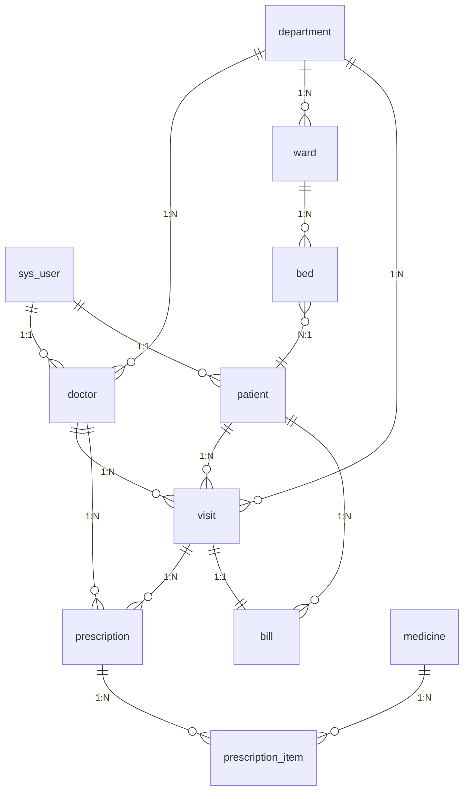
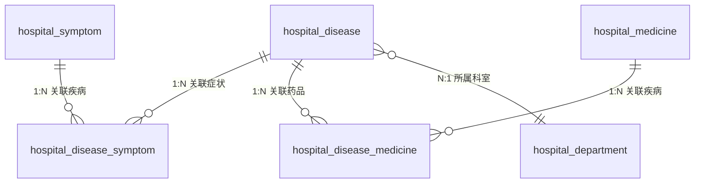

# 智能医院管理系统 — 总体设计文档


> 版本：v2.0（含原型扩展）

> 说明：本文档整合了原数据库课程设计内容（v1.0）与六个扩展方向（v2.0 医疗知识图谱 / 智能数据可视化 / 医疗知识图谱 / 智能数据可视化），形成完整的计算机应用大作业原型设计方案。标注 【✅ 已实现】 表示 v1.0 已完成的功能，标注 【🆕 扩展】 表示 v2.0 新增的模块。


---


## 一、项目概述


本项目是为数据库原理课程设计的大作业，旨在开发一套完整的智能医院管理系统，实现医院日常业务的数字化管理。系统围绕病人全生命周期的就医流程，整合了患者信息管理、医生诊疗、药品管理、收费结算等核心业务模块，通过规范化的数据库设计与前后端分离的架构，提升医院的运营效率与数据管理的规范性。


本系统适用于中小型医院的门诊与住院部管理。v1.0 已实现基础门诊与住院流程的 CRUD 功能，v2.0 在此基础上聚焦两个创新方向：**AI 增强医疗知识图谱**（将结构化医学知识以图结构存储，结合大语言模型实现辅助诊断与处方审核）和**智能数据可视化**（通过热力图、雷达图、桑基图等高级图表实现多维数据挖掘），使系统从传统 CRUD 信息管理升级为具备数据智能能力的医疗平台原型，既满足课程设计中对数据库建模的教学要求，也体现当前 AI 技术与数据库系统的融合趋势。


---


## 二、需求分析


### 2.1 角色定义


系统设计了三类用户角色，不同角色拥有不同的权限与功能视图：


1. **系统管理员**：负责系统的整体维护，包括用户管理、科室配置、基础数据维护、排班设置、检查项目配置、供应商管理、数据统计分析等。


2. **医生**：负责接诊患者，管理就诊记录、书写电子病历、开具处方、开具检查申请、查看检查报告等诊疗相关操作。


3. **患者**：可查看个人就诊记录、处方信息、检查报告，进行在线预约挂号等自助操作。


> 🆕 扩展：v2.0 引入了 AI 辅助能力，系统各角色均可受益——管理员可查看 AI 生成的数据洞察报告，医生可获得 AI 处方审核建议，患者可体验 AI 辅助诊断。AI 能力以独立的 API 服务模块集成，不改变现有 RBAC 权限体系。


### 2.2 功能需求


#### 2.2.1 用户权限管理 ✅ 已实现


- 支持不同角色的登录与身份验证

- 基于 RBAC 角色的权限控制，确保数据访问安全

- 用户密码 BCrypt 加密存储，保障账户安全


#### 2.2.2 基础信息管理 ✅ 已实现


- 科室信息的增删改查与维护

- 医生档案管理，包含职称、所属科室、执业信息等

- 病房与床位信息管理，实时更新床位使用状态


#### 2.2.3 病人信息管理 ✅ 已实现


- 患者基本档案的录入、修改与查询

- 患者既往病史、医保信息的维护

- 患者入院、出院登记流程管理


#### 2.2.4 就诊与病历管理 ✅ 已实现


- 门诊挂号与住院登记

- 就诊记录的全流程跟踪

- 电子病历的书写与归档

- 诊断结果与病情备注管理


#### 2.2.5 药品与处方管理 ✅ 已实现


- 药品基础信息与库存管理

- 医生开具处方功能

- 处方明细的详细记录，包含用法用量

- 处方状态跟踪（未发药 / 已发药）


#### 2.2.6 收费结算管理 ✅ 已实现


- 就诊费用的自动核算

- 账单生成与支付记录

- 支付方式与结算状态管理


#### 2.2.7 数据统计分析 ✅ 已实现


- 患者出入院趋势统计

- 科室接诊量分析

- 药品使用与库存预警

- 可视化报表展示


#### 2.2.8 🆕 AI 增强医疗知识图谱（创新模块一）


- 疾病字典管理：收录常见疾病信息（名称、ICD 编码、所属科室、疾病分类、典型症状描述）

- 症状字典管理：收录常见临床症状信息（名称、所属部位、症状类型）

- 疾病-症状关联：建立疾病与症状的多对多映射关系，标注关联强度（主要症状/次要症状/偶见症状）和文献支持

- 疾病-药品关联：建立疾病与治疗药品的多对多映射关系，标注用药类型（首选/备选/辅助）

- 图谱可视化：前端以 ECharts 关系图展示「症状 → 可能疾病 → 推荐药品」的关联网络，支持节点点击交互

- 智能推理辅助：输入一组症状，系统从知识图谱中检索匹配的疾病，按症状覆盖率排序推荐
- 🆕 AI 辅助诊断：医生输入患者症状描述，大语言模型提取关键症状实体并映射到知识图谱，结合 RAG 检索的疾病信息生成个性化的诊断参考建议（参考科室、紧急程度评估、就诊前注意事项）
- 🆕 AI 处方审核：医生开具处方后，将处方药品列表 + 患者诊断 + 知识图谱中的疾病-药品关联信息发送给大模型，AI 审核潜在的药物相互作用、禁忌症和剂量风险，生成审核报告


> 本模块的核心技术价值在于：
> 1. **数据建模创新**：将传统关系型数据库中的多对多关联关系以图结构的方式可视化呈现，验证了「关系模型 → 图模型」的数据建模能力
> 2. **RAG 架构实践**：知识图谱作为结构化知识的检索层（Retrieval），大语言模型作为自然语言理解层（Generation），形成了"数据库 → 图检索 → AI 推理"的三层技术栈
> 3. **零外部图数据库依赖**：完全基于 OpenGauss/MySQL 的 JOIN 查询实现图遍历，用 ECharts graph 在前端渲染，用大模型 API 做语义增强，架构简洁但技术深度足够


#### 2.2.9 🆕 智能数据可视化与数据挖掘（创新模块二）


- 科室接诊热力图：以「就诊时段（小时）× 科室」为轴，用颜色深浅展示接诊密度分布，直观识别高峰科室和高峰时段，辅助排班决策

- 患者人口学画像：年龄金字塔（性别分层）、地区分布地图、医保类型占比等多维度患者构成分析

- 科室综合能力雷达图：从「接诊量、治愈率、平均费用、患者满意度、检查阳性率」五个维度评估科室能力

- 疾病季节性趋势：按月份统计各病种的接诊量变化，识别季节性高发疾病

- 药品使用关联分析：从处方数据中挖掘高频联合用药组合，为药库备货提供参考

- 住院流转分析：桑基图展示患者从「入院科室 → 转科 → 出院科室」的流转路径


> 本模块的核心技术价值在于：不依赖外部数据挖掘平台，完全基于系统自身的业务数据（就诊、处方、患者信息），通过 SQL 聚合查询 + ECharts 高级图表类型（热力图、雷达图、桑基图）在 Web 前端实时呈现多维分析结果，体现「OLTP 业务数据 → OLAP 分析洞察」的完整数据价值链。

### 2.3 非功能需求


- 数据一致性：通过数据库外键约束保障数据的完整性，避免脏数据

- 性能：支持百级用户的并发访问，常用查询响应时间小于 1 秒

- 可扩展性：模块化设计，支持后续功能的扩展，如知识图谱推理、AI 辅助诊断等

- 易用性：前端界面简洁直观，符合医院工作人员的操作习惯


---


## 三、系统架构设计


本系统采用主流的**前后端分离**架构，实现前后端解耦，提升开发效率与系统可维护性。


### 3.1 技术选型


|层级|技术选型|说明|

|---|---|---|

|前端层|Vue 3 + Element Plus + Axios + Vue Router + ECharts|采用 Composition API 开发，基于 yudao-ui-admin-vue3 前端框架，使用 Element Plus 提供成熟的后台组件，ECharts 实现数据可视化驾驶舱|

|后端层|Spring Boot 2.7 + MyBatis-Plus + Spring Security + RuoYi-vue-pro|基于 RuoYi-vue-pro 企业级快速开发框架，内置 RBAC 权限控制、多租户、代码生成等能力|

|数据层|OpenGauss / MySQL 8.0|关系型数据库，满足关系建模与事务需求|

|缓存层|Redis|缓存用户 Token、权限信息、字典数据，提升接口响应速度|

|认证层|Token + Redis|登录后生成 Token 存入 Redis，后续请求通过 Token 校验身份；支持多租户隔离|

### 3.2 架构流程


1. 用户通过浏览器访问前端应用，前端通过 Axios 向后端发送 API 请求

2. 后端接收到请求后，进行身份验证与权限校验

3. 业务层处理业务逻辑，通过持久层与数据库交互

4. 后端将处理结果以统一的 JSON 格式返回给前端

5. 前端解析结果，渲染页面展示给用户


---


## 四、功能模块设计


系统整体功能模块划分如下（🆕 标注为 v2.0 新增）：

\\Plain Text
智能医院管理系统
├── 系统管理 ✅
│   ├── 用户登录/退出
│   ├── 个人信息维护
│   └── 权限控制
├── 基础数据管理 ✅
│   ├── 科室管理
│   ├── 医生管理
│   ├── 病房床位管理
│   └── 药品信息管理
├── 病人管理 ✅
│   ├── 病人档案管理
│   ├── 入院登记
│   └── 出院办理
├── 诊疗管理 ✅
│   ├── 门诊挂号
│   ├── 就诊记录管理
│   ├── 电子病历
│   └── 处方开具
├── 收费管理 ✅
│   ├── 账单生成
│   ├── 费用结算
│   └── 支付记录
├── 统计分析 ✅
│   ├── 就诊数据统计
│   ├── 床位使用率分析
│   └── 药品库存统计
├── 🆕 AI 增强医疗知识图谱
│   ├── 疾病与症状字典管理
│   ├── 疾病-症状-药品关联图谱
│   ├── ECharts 力导向图可视化
│   ├── AI 辅助诊断（症状 → 推理 → 参考科室）
│   └── AI 处方审核（知识图谱 + 大模型双重校验）
└── 🆕 智能数据可视化
    ├── 科室接诊热力图（时间 × 科室）
    ├── 患者画像（年龄金字塔/地区分布）
    ├── 科室能力雷达图
    ├── 疾病季节性趋势
    ├── 药品联合使用分析
    └── 住院流转桑基图
\## 五、数据库设计


数据库设计是本系统的核心，严格遵循数据库设计的三大范式，消除数据冗余，保障数据一致性。


### 5.1 概念模型设计（ER 图）


#### 5.1.1 v1.0 核心实体 ✅ 已实现


系统的核心实体包括用户、科室、医生、病人、病房、床位、就诊记录、处方、药品、账单等，实体间的关系如下图所示：





#### 5.1.2 🆕 医疗知识图谱子系统（v2.0 创新模块一）




#### 5.1.3 完整业务链路总览


```
医生输入患者症状（自然语言）
    |
    v
🆕 AI 辅助诊断（大模型 + 知识图谱 RAG）
    ├── 大模型提取症状实体
    ├── 知识图谱检索匹配疾病
    └── AI 生成诊断参考建议（参考科室/紧急程度）
    |
    v
✅ 就诊 → ✅ 诊断 → ✅ 开方
    |
    ├──────────────┐
    |              |
    v              v
✅ 发药    🆕 AI 处方审核
           ├── 知识图谱：检索疾病-药品关联
           └── 大模型：检查相互作用/禁忌症
    |              |
    v              v
✅ 账单支付 ← 审核通过

🆕 可视化层（基于现有数据 SQL 聚合，零新表）
├── 热力图：科室接诊高峰分析
├── 雷达图：科室综合能力对比
├── 桑基图：患者住院流转路径
├── 知识图谱：ECharts 力导向图
└── 患者画像：年龄金字塔/地区分布
``system_users`)


由 RuoYi-vue-pro 框架内置提供，存储所有系统用户的登录信息，统一管理管理员、医生、患者的账户。


|字段名|数据类型|约束|说明|

|---|---|---|---|

|`id`|BIGINT|PRIMARY KEY|用户唯一 ID|

|`username`|VARCHAR(30)|UNIQUE|登录用户名|

|`password`|VARCHAR(100)|NOT NULL|BCrypt 加密后的密码|

|`nickname`|VARCHAR(30)|NOT NULL|用户昵称|

|`status`|SMALLINT|DEFAULT 0|账户状态：0 正常 / 1 禁用|

|`tenant_id`|BIGINT|NOT NULL|所属租户 ID|

|`create_time`|TIMESTAMP|NOT NULL|创建时间|


> 注：角色通过 RBAC 角色表（`system_role`）管理，用户与角色通过 `system_user_role` 关联，不在本表中以字段形式存储。


#### 【✅ 已实现】2. 科室表 (`hospital_department`)


存储医院科室的基础信息。


|字段名|数据类型|约束|说明|

|---|---|---|---|

|`id`|BIGINT|PRIMARY KEY|科室 ID（序列生成）|

|`dept_name`|VARCHAR(50)|NOT NULL|科室名称|

|`phone`|VARCHAR(20)||科室联系电话|

|`manager`|VARCHAR(50)||科室主任|

|`location`|VARCHAR(100)||科室位置|

|`description`|TEXT||科室描述|

|`creator`|VARCHAR(64)|DEFAULT ''|创建者|

|`create_time`|TIMESTAMP|NOT NULL|创建时间|

|`updater`|VARCHAR(64)|DEFAULT ''|更新者|

|`update_time`|TIMESTAMP|NOT NULL|更新时间|

|`deleted`|SMALLINT|DEFAULT 0|逻辑删除标记：0 正常 / 1 已删除|

|`tenant_id`|BIGINT|NOT NULL|租户编号|


#### 【✅ 已实现】3. 医生信息表 (`hospital_doctor`)


存储医生的详细档案信息。


|字段名|数据类型|约束|说明|

|---|---|---|---|

|`id`|BIGINT|PRIMARY KEY|医生 ID（序列生成）|

|`user_id`|BIGINT||关联系统用户表的用户 ID|

|`dept_id`|BIGINT||关联科室表的科室 ID|

|`name`|VARCHAR(50)|NOT NULL|医生姓名|

|`gender`|VARCHAR(10)||性别（字典值：1男/2女）|

|`age`|INT||年龄|

|`title`|VARCHAR(50)||职称（字典值：1主任医师/2副主任医师/3主治医师/4住院医师）|

|`license_no`|VARCHAR(50)||执业医师证编号|

|`phone`|VARCHAR(20)||联系电话|

|`email`|VARCHAR(100)||邮箱|

|`creator`|VARCHAR(64)|DEFAULT ''|创建者|

|`create_time`|TIMESTAMP|NOT NULL|创建时间|

|`updater`|VARCHAR(64)|DEFAULT ''|更新者|

|`update_time`|TIMESTAMP|NOT NULL|更新时间|

|`deleted`|SMALLINT|DEFAULT 0|逻辑删除标记|

|`tenant_id`|BIGINT|NOT NULL|租户编号|


#### 【✅ 已实现】4. 病人信息表 (`hospital_patient`)


存储患者的详细档案信息。


|字段名|数据类型|约束|说明|

|---|---|---|


疾病字典表 (`hospital_disease`) （知识图谱）


收录常见疾病信息，作为知识图谱的核心节点。


| 字段名 | 数据类型 | 约束 | 说明 |

|--------|----------|------|------|

| `id` | BIGINT | PRIMARY KEY | 疾病 ID（序列生成） |

| `name` | VARCHAR(100) | NOT NULL | 疾病名称 |

| `icd_code` | VARCHAR(20) | | ICD-10 编码（如 J06.9） |

| `category` | VARCHAR(50) | | 疾病分类：内科/外科/儿科/妇产科等 |

| `dept_id` | BIGINT | | 所属科室 ID，关联 `hospital_department.id` |

| `description` | TEXT | | 疾病简介 |

| `typical_symptoms` | TEXT | | 典型症状文本描述（冗余，便于全文检索） |

| `is_common` | SMALLINT | DEFAULT 0 | 是否常见病：1是/0否 |

| `creator` | VARCHAR(64) | DEFAULT '' | 创建者 |

| `create_time` | TIMESTAMP | NOT NULL | 创建时间 |

| `updater` | VARCHAR(64) | DEFAULT '' | 更新者 |

| `update_time` | TIMESTAMP | NOT NULL | 更新时间 |

| `deleted` | SMALLINT | DEFAULT 0 | 逻辑删除 |

| `tenant_id` | BIGINT | NOT NULL | 租户编号 |


#### 【🆕 扩展】13. 症状字典表 (`hospital_symptom`) （知识图谱）


收录常见临床症状。


| 字段名 | 数据类型 | 约束 | 说明 |

|--------|----------|------|------|

| `id` | BIGINT | PRIMARY KEY | 症状 ID（序列生成） |

| `name` | VARCHAR(100) | NOT NULL | 症状名称（如"发热"） |

| `location` | VARCHAR(50) | | 症状部位：全身/头部/胸腹部/四肢等 |

| `type` | VARCHAR(50) | | 症状类型：主观感受/客观体征 |

| `description` | VARCHAR(500) | | 症状描述 |

| `creator` | VARCHAR(64) | DEFAULT '' | 创建者 |

| `create_time` | TIMESTAMP | NOT NULL | 创建时间 |

| `updater` | VARCHAR(64) | DEFAULT '' | 更新者 |

| `update_time` | TIMESTAMP | NOT NULL | 更新时间 |

| `deleted` | SMALLINT | DEFAULT 0 | 逻辑删除 |

| `tenant_id` | BIGINT | NOT NULL | 租户编号 |


#### 【🆕 扩展】14. 疾病-症状关联表 (`hospital_disease_symptom`) （知识图谱）


疾病与症状的多对多关联，是知识图谱的"边"。


| 字段名 | 数据类型 | 约束 | 说明 |

|--------|----------|------|------|

| `id` | BIGINT | PRIMARY KEY | 关联 ID（序列生成） |

| `disease_id` | BIGINT | NOT NULL | 疾病 ID，关联 `hospital_disease.id` |

| `symptom_id` | BIGINT | NOT NULL | 症状 ID，关联 `hospital_symptom.id` |

| `strength` | VARCHAR(20) | NOT NULL DEFAULT '2' | 关联强度：1主要症状/2次要症状/3偶见症状 |

| `reference` | VARCHAR(500) | | 文献/指南依据 |

| `creator` | VARCHAR(64) | DEFAULT '' | 创建者 |

| `create_time` | TIMESTAMP | NOT NULL | 创建时间 |

| `updater` | VARCHAR(64) | DEFAULT '' | 更新者 |

| `update_time` | TIMESTAMP | NOT NULL | 更新时间 |

| `deleted` | SMALLINT | DEFAULT 0 | 逻辑删除 |

| `tenant_id` | BIGINT | NOT NULL | 租户编号 |


#### 【🆕 扩展】15. 疾病-药品关联表 (`hospital_disease_medicine`) （知识图谱）


疾病与治疗药品的多对多关联。


| 字段名 | 数据类型 | 约束 | 说明 |

|--------|----------|------|------|

| `id` | BIGINT | PRIMARY KEY | 关联 ID（序列生成） |

| `disease_id` | BIGINT | NOT NULL | 疾病 ID，关联 `hospital_disease.id` |

| `medicine_id` | BIGINT | NOT NULL | 药品 ID，关联 `hospital_medicine.id` |

| `usage_type` | VARCHAR(20) | DEFAULT '1' | 用药类型：1首选/2备选/3辅助 |

| `notes` | VARCHAR(500) | | 用药说明 |

| `creator` | VARCHAR(64) | DEFAULT '' | 创建者 |

| `create_time` | TIMESTAMP | NOT NULL | 创建时间 |

| `updater` | VARCHAR(64) | DEFAULT '' | 更新者 |

| `update_time` | TIMESTAMP | NOT NULL | 更新时间 |

| `deleted` | SMALLINT | DEFAULT 0 | 逻辑删除 |

| `tenant_id` | BIGINT | NOT NULL | 租户编号 |

### 5.3 数据库扩展汇总

| 序号 | 表名 | 来源 | 所属模块 | 说明 |
|------|------|------|----------|------|
| 1~11 | hospital_department 等 | ✅ 已实现 | 现有 | v1.0 核心业务表（科室/医生/患者/病房/床位/就诊/处方/药品/账单） |
| 12 | hospital_disease | 🆕 扩展 | AI 知识图谱 | 疾病字典 |
| 13 | hospital_symptom | 🆕 扩展 | AI 知识图谱 | 症状字典 |
| 14 | hospital_disease_symptom | 🆕 扩展 | AI 知识图谱 | 疾病-症状关联（N:N 图边，RAG 检索层） |
| 15 | hospital_disease_medicine | 🆕 扩展 | AI 知识图谱 | 疾病-药品关联（N:N 图边，供 AI 处方审核使用） |

**总计**：现有 11 张业务表 + 4 张新表（创新模块）= **15 张业务表**（不含系统框架表）。

> 与常规医院管理系统的区别：v2.0 并未在 CRUD 业务线上做横向扩展，而是通过 AI 增强知识图谱和数据可视化两个模块做**纵向创新**——用图结构组织数据的关联方式，用大模型 API 赋予系统推理能力，用高级图表替代传统表格展示。

### 5.4 数据库创建 SQL 脚本


#### 5.4.1 ✅ 已实现 — OpenGauss 建表脚本


> 以下为 v1.0 的 10 张业务表建表语句，已在 `sql/db2/hospital.sql`（OpenGauss）和 `sql/mysql/hospital.sql`（MySQL）中实现。


```sql

-- =============================================

-- 智能医院管理系统 - OpenGauss 建表脚本 (v1.0)

-- =============================================


-- 1. 科室表

DROP TABLE IF EXISTS hospital_department;

CREATE TABLE hospital_department

(

    id          int8         NOT NULL,

    dept_name   varchar(50)  NOT NULL,

    phone       varchar(20)  NULL     DEFAULT NULL,

    manager     varchar(50)  NULL     DEFAULT NULL,

    location    varchar(100) NULL     DEFAULT NULL,

    description text         NULL     DEFAULT NULL,

    creator     varchar(64)  NULL     DEFAULT '',

    create_time timestamp    NOT NULL DEFAULT CURRENT_TIMESTAMP,

    updater     varchar(64)  NULL     DEFAULT '',

    update_time timestamp    NOT NULL DEFAULT CURRENT_TIMESTAMP,

    deleted     int2         NOT NULL DEFAULT 0,

    tenant_id   int8         NOT NULL DEFAULT 0

);

ALTER TABLE hospital_department ADD CONSTRAINT pk_hospital_department PRIMARY KEY (id);

DROP SEQUENCE IF EXISTS hospital_department_seq;

CREATE SEQUENCE hospital_department_seq START 1;


-- 2. 医生信息表

DROP TABLE IF EXISTS hospital_doctor;

CREATE TABLE hospital_doctor

(

    id          int8         NOT NULL,

    user_id     int8         NULL     DEFAULT NULL,

    dept_id     int8         NULL     DEFAULT NULL,

    name        varchar(50)  NOT NULL,

    gender      varchar(10)  NULL     DEFAULT NULL,

    age         int4         NULL     DEFAULT NULL,

    title       varchar(50)  NULL     DEFAULT NULL,

    license_no  varchar(50)  NULL     DEFAULT NULL,

    phone       varchar(20)  NULL     DEFAULT NULL,

    email       varchar(100) NULL     DEFAULT NULL,

    creator     varchar(64)  NULL     DEFAULT '',

    create_time timestamp    NOT NULL DEFAULT CURRENT_TIMESTAMP,

    updater     varchar(64)  NULL     DEFAULT '',

    update_time timestamp    NOT NULL DEFAULT CURRENT_TIMESTAMP,

    deleted     int2         NOT NULL DEFAULT 0,

    tenant_id   int8         NOT NULL DEFAULT 0

);

ALTER TABLE hospital_doctor ADD CONSTRAINT pk_hospital_doctor PRIMARY KEY (id);

DROP SEQUENCE IF EXISTS hospital_doctor_seq;

CREATE SEQUENCE hospital_doctor_seq START 1;


-- 3. 病人信息表

DROP TABLE IF EXISTS hospital_patient;

CREATE TABLE hospital_patient

(

    id                int8         NOT NULL,

    user_id           int8         NULL     DEFAULT NULL,

    name              varchar(50)  NOT NULL,

    gender            varchar(10)  NULL     DEFAULT NULL,

    birth_date        date         NULL     DEFAULT NULL,

    id_card           varchar(18)  NULL     DEFAULT NULL,

    phone             varchar(20)  NULL     DEFAULT NULL,

    address           varchar(200) NULL     DEFAULT NULL,

    emergency_contact varchar(50)  NULL     DEFAULT NULL,

    emergency_phone   varchar(20)  NULL     DEFAULT NULL,

    insurance_no      varchar(50)  NULL     DEFAULT NULL,

    medical_history   text         NULL     DEFAULT NULL,

    admission_date    date         NULL     DEFAULT NULL,

    creator           varchar(64)  NULL     DEFAULT '',

    create_time       timestamp    NOT NULL DEFAULT CURRENT_TIMESTAMP,

    updater           varchar(64)  NULL     DEFAULT '',

    update_time       timestamp    NOT NULL DEFAULT CURRENT_TIMESTAMP,

    deleted           int2         NOT NULL DEFAULT 0,

    tenant_id         int8         NOT NULL DEFAULT 0

);

ALTER TABLE hospital_patient ADD CONSTRAINT pk_hospital_patient PRIMARY KEY (id);

DROP SEQUENCE IF EXISTS hospital_patient_seq;

CREATE SEQUENCE hospital_patient_seq START 1;


-- 【🆕 扩展】为 hospital_patient 增加住院字段（v2.0）

-- ALTER TABLE hospital_patient ADD COLUMN nursing_level_id int8 NULL DEFAULT NULL;

-- ALTER TABLE hospital_patient ADD COLUMN bed_id int8 NULL DEFAULT NULL;

-- ALTER TABLE hospital_patient ADD COLUMN inpatient_status varchar(20) NULL DEFAULT '0';

-- ALTER TABLE hospital_patient ADD COLUMN discharge_date date NULL DEFAULT NULL;


-- 4. 病房表

DROP TABLE IF EXISTS hospital_ward;

CREATE TABLE hospital_ward

(

    id          int8         NOT NULL,

    dept_id     int8         NULL     DEFAULT NULL,

    ward_no     varchar(20)  NULL     DEFAULT NULL,

    type        varchar(20)  NULL     DEFAULT NULL,

    capacity    int4         NOT NULL,

    used_beds   int4         NOT NULL DEFAULT 0,

    status      int2         NOT NULL DEFAULT 1,

    description varchar(200) NULL     DEFAULT NULL,

    creator     varchar(64)  NULL     DEFAULT '',

    create_time timestamp    NOT NULL DEFAULT CURRENT_TIMESTAMP,

    updater     varchar(64)  NULL     DEFAULT '',

    update_time timestamp    NOT NULL DEFAULT CURRENT_TIMESTAMP,

    deleted     int2         NOT NULL DEFAULT 0,

    tenant_id   int8         NOT NULL DEFAULT 0

);

ALTER TABLE hospital_ward ADD CONSTRAINT pk_hospital_ward PRIMARY KEY (id);

DROP SEQUENCE IF EXISTS hospital_ward_seq;

CREATE SEQUENCE hospital_ward_seq START 1;


-- 5. 床位表

DROP TABLE IF EXISTS hospital_bed;

CREATE TABLE hospital_bed

(

    id             int8        NOT NULL,

    ward_id        int8        NULL     DEFAULT NULL,

    bed_no         varchar(10) NULL     DEFAULT NULL,

    status         varchar(20) NOT NULL,

    patient_id     int8        NULL     DEFAULT NULL,

    admission_time timestamp   NULL     DEFAULT NULL,

    creator        varchar(64) NULL     DEFAULT '',

    create_time    timestamp   NOT NULL DEFAULT CURRENT_TIMESTAMP,

    updater        varchar(64) NULL     DEFAULT '',

    update_time    timestamp   NOT NULL DEFAULT CURRENT_TIMESTAMP,

    deleted        int2        NOT NULL DEFAULT 0,

    tenant_id      int8        NOT NULL DEFAULT 0

);

ALTER TABLE hospital_bed ADD CONSTRAINT pk_hospital_bed PRIMARY KEY (id);

DROP SEQUENCE IF EXISTS hospital_bed_seq;

CREATE SEQUENCE hospital_bed_seq START 1;


-- 6. 就诊记录表

DROP TABLE IF EXISTS hospital_visit;

CREATE TABLE hospital_visit

(

    id          int8         NOT NULL,

    patient_id  int8         NULL     DEFAULT NULL,

    doctor_id   int8         NULL     DEFAULT NULL,

    dept_id     int8         NULL     DEFAULT NULL,

    visit_date  timestamp    NOT NULL,

    reason      varchar(200) NULL     DEFAULT NULL,

    diagnosis   text         NULL     DEFAULT NULL,

    notes       text         NULL     DEFAULT NULL,

    status      varchar(20)  NOT NULL,

    creator     varchar(64)  NULL     DEFAULT '',

    create_time timestamp    NOT NULL DEFAULT CURRENT_TIMESTAMP,

    updater     varchar(64)  NULL     DEFAULT '',

    update_time timestamp    NOT NULL DEFAULT CURRENT_TIMESTAMP,

    deleted     int2         NOT NULL DEFAULT 0,

    tenant_id   int8         NOT NULL DEFAULT 0

);

ALTER TABLE hospital_visit ADD CONSTRAINT pk_hospital_visit PRIMARY KEY (id);

DROP SEQUENCE IF EXISTS hospital_visit_seq;

CREATE SEQUENCE hospital_visit_seq START 1;


-- 7. 药品信息表

DROP TABLE IF EXISTS hospital_medicine;

CREATE TABLE hospital_medicine

(

    id            int8          NOT NULL,

    name          varchar(100)  NOT NULL,

    specification varchar(50)   NULL     DEFAULT NULL,

    unit          varchar(20)   NULL     DEFAULT NULL,

    price         numeric(10,2) NOT NULL,

    stock         int4          NOT NULL DEFAULT 0,

    manufacturer  varchar(100)  NULL     DEFAULT NULL,

    expiry_date   date          NULL     DEFAULT NULL,

    creator       varchar(64)   NULL     DEFAULT '',

    create_time   timestamp     NOT NULL DEFAULT CURRENT_TIMESTAMP,

    updater       varchar(64)   NULL     DEFAULT '',

    update_time   timestamp     NOT NULL DEFAULT CURRENT_TIMESTAMP,

    deleted       int2          NOT NULL DEFAULT 0,

    tenant_id     int8          NOT NULL DEFAULT 0

);

ALTER TABLE hospital_medicine ADD CONSTRAINT pk_hospital_medicine PRIMARY KEY (id);

DROP SEQUENCE IF EXISTS hospital_medicine_seq;

CREATE SEQUENCE hospital_medicine_seq START 1;


-- 8. 处方表

DROP TABLE IF EXISTS hospital_prescription;

CREATE TABLE hospital_prescription

(

    id          int8         NOT NULL,

    visit_id    int8         NULL     DEFAULT NULL,

    doctor_id   int8         NULL     DEFAULT NULL,

    status      varchar(20)  NOT NULL,

    notes       text         NULL     DEFAULT NULL,

    creator     varchar(64)  NULL     DEFAULT '',

    create_time timestamp    NOT NULL DEFAULT CURRENT_TIMESTAMP,

    updater     varchar(64)  NULL     DEFAULT '',

    update_time timestamp    NOT NULL DEFAULT CURRENT_TIMESTAMP,

    deleted     int2         NOT NULL DEFAULT 0,

    tenant_id   int8         NOT NULL DEFAULT 0

);

ALTER TABLE hospital_prescription ADD CONSTRAINT pk_hospital_prescription PRIMARY KEY (id);

DROP SEQUENCE IF EXISTS hospital_prescription_seq;

CREATE SEQUENCE hospital_prescription_seq START 1;


-- 9. 处方明细表

DROP TABLE IF EXISTS hospital_prescription_item;

CREATE TABLE hospital_prescription_item

(

    id              int8          NOT NULL,

    prescription_id int8          NULL     DEFAULT NULL,

    medicine_id     int8          NULL     DEFAULT NULL,

    quantity        int4          NOT NULL,

    price           numeric(10,2) NOT NULL,

    instructions    varchar(200)  NULL     DEFAULT NULL,

    creator         varchar(64)   NULL     DEFAULT '',

    create_time     timestamp     NOT NULL DEFAULT CURRENT_TIMESTAMP,

    updater         varchar(64)   NULL     DEFAULT '',

    update_time     timestamp     NOT NULL DEFAULT CURRENT_TIMESTAMP,

    deleted         int2          NOT NULL DEFAULT 0,

    tenant_id       int8          NOT NULL DEFAULT 0

);

ALTER TABLE hospital_prescription_item ADD CONSTRAINT pk_hospital_prescription_item PRIMARY KEY (id);

DROP SEQUENCE IF EXISTS hospital_prescription_item_seq;

CREATE SEQUENCE hospital_prescription_item_seq START 1;


-- 10. 收费账单表

DROP TABLE IF EXISTS hospital_bill;

CREATE TABLE hospital_bill

(

    id           int8          NOT NULL,

    visit_id     int8          NULL     DEFAULT NULL,

    patient_id   int8          NULL     DEFAULT NULL,

    total_amount numeric(10,2) NOT NULL,

    pay_amount   numeric(10,2) NOT NULL DEFAULT 0,

    pay_time     timestamp     NULL     DEFAULT NULL,

    pay_method   varchar(20)   NULL     DEFAULT NULL,

    status       varchar(20)   NOT NULL,

    creator      varchar(64)   NULL     DEFAULT '',

    create_time  timestamp     NOT NULL DEFAULT CURRENT_TIMESTAMP,

    updater      varchar(64)   NULL     DEFAULT '',

    update_time  timestamp     NOT NULL DEFAULT CURRENT_TIMESTAMP,

    deleted      int2          NOT NULL DEFAULT 0,

    tenant_id    int8          NOT NULL DEFAULT 0

);

ALTER TABLE hospital_bill ADD CONSTRAINT pk_hospital_bill PRIMARY KEY (id);

DROP SEQUENCE IF EXISTS hospital_bill_seq;

CREATE SEQUENCE hospital_bill_seq START 1;

```


#### 5.4.2 🆕 扩展（v2.0 创新模块：AI 增强知识图谱）

`sql
-- =============================================
-- AI知识图谱建表脚本 (v2.0)
-- =============================================

-- 12. 疾病字典表
DROP TABLE IF EXISTS hospital_disease;
CREATE TABLE hospital_disease
(
    id               int8         NOT NULL,
    name             varchar(100) NOT NULL,
    icd_code         varchar(20)  NULL     DEFAULT NULL,
    category         varchar(50)  NULL     DEFAULT NULL,
    dept_id          int8         NULL     DEFAULT NULL,
    description      text         NULL     DEFAULT NULL,
    typical_symptoms text         NULL     DEFAULT NULL,
    is_common        int2         NOT NULL DEFAULT 0,
    creator          varchar(64)  NULL     DEFAULT '',
    create_time      timestamp    NOT NULL DEFAULT CURRENT_TIMESTAMP,
    updater          varchar(64)  NULL     DEFAULT '',
    update_time      timestamp    NOT NULL DEFAULT CURRENT_TIMESTAMP,
    deleted          int2         NOT NULL DEFAULT 0,
    tenant_id        int8         NOT NULL DEFAULT 0
);
ALTER TABLE hospital_disease ADD CONSTRAINT pk_hospital_disease PRIMARY KEY (id);
DROP SEQUENCE IF EXISTS hospital_disease_seq;
CREATE SEQUENCE hospital_disease_seq START 1;

-- 13. 症状字典表
DROP TABLE IF EXISTS hospital_symptom;
CREATE TABLE hospital_symptom
(
    id          int8         NOT NULL,
    name        varchar(100) NOT NULL,
    location    varchar(50)  NULL     DEFAULT NULL,
    type        varchar(50)  NULL     DEFAULT NULL,
    description varchar(500) NULL     DEFAULT NULL,
    creator     varchar(64)  NULL     DEFAULT '',
    create_time timestamp    NOT NULL DEFAULT CURRENT_TIMESTAMP,
    updater     varchar(64)  NULL     DEFAULT '',
    update_time timestamp    NOT NULL DEFAULT CURRENT_TIMESTAMP,
    deleted     int2         NOT NULL DEFAULT 0,
    tenant_id   int8         NOT NULL DEFAULT 0
);
ALTER TABLE hospital_symptom ADD CONSTRAINT pk_hospital_symptom PRIMARY KEY (id);
DROP SEQUENCE IF EXISTS hospital_symptom_seq;
CREATE SEQUENCE hospital_symptom_seq START 1;

-- 14. 疾病-症状关联表
DROP TABLE IF EXISTS hospital_disease_symptom;
CREATE TABLE hospital_disease_symptom
(
    id          int8         NOT NULL,
    disease_id  int8         NOT NULL,
    symptom_id  int8         NOT NULL,
    strength    varchar(20)  NOT NULL DEFAULT '2',
    reference   varchar(500) NULL     DEFAULT NULL,
    creator     varchar(64)  NULL     DEFAULT '',
    create_time timestamp    NOT NULL DEFAULT CURRENT_TIMESTAMP,
    updater     varchar(64)  NULL     DEFAULT '',
    update_time timestamp    NOT NULL DEFAULT CURRENT_TIMESTAMP,
    deleted     int2         NOT NULL DEFAULT 0,
    tenant_id   int8         NOT NULL DEFAULT 0
);
ALTER TABLE hospital_disease_symptom ADD CONSTRAINT pk_hospital_disease_symptom PRIMARY KEY (id);
DROP SEQUENCE IF EXISTS hospital_disease_symptom_seq;
CREATE SEQUENCE hospital_disease_symptom_seq START 1;

-- 15. 疾病-药品关联表
DROP TABLE IF EXISTS hospital_disease_medicine;
CREATE TABLE hospital_disease_medicine
(
    id          int8         NOT NULL,
    disease_id  int8         NOT NULL,
    medicine_id int8         NOT NULL,
    usage_type  varchar(20)  NOT NULL DEFAULT '1',
    notes       varchar(500) NULL     DEFAULT NULL,
    creator     varchar(64)  NULL     DEFAULT '',
    create_time timestamp    NOT NULL DEFAULT CURRENT_TIMESTAMP,
    updater     varchar(64)  NULL     DEFAULT '',
    update_time timestamp    NOT NULL DEFAULT CURRENT_TIMESTAMP,
    deleted     int2         NOT NULL DEFAULT 0,
    tenant_id   int8         NOT NULL DEFAULT 0
);
ALTER TABLE hospital_disease_medicine ADD CONSTRAINT pk_hospital_disease_medicine PRIMARY KEY (id);
DROP SEQUENCE IF EXISTS hospital_disease_medicine_seq;
CREATE SEQUENCE hospital_disease_medicine_seq START 1;
`
```
> 注：可视化模块不新增数据库表，所有图表数据均通过 SQL 聚合查询从现有表中实时计算。


## 六、API 接口设计


系统的接口遵循 RESTful 设计规范，采用统一的请求与响应格式，方便前后端协作开发。


### 6.1 接口通用规范 ✅ 已实现


- **请求前缀**：所有接口均以 `/admin-api/hospital` 为前缀（由 RuoYi-vue-pro 框架约定）

- **请求方法**：`GET`（查询）/ `POST`（创建）/ `PUT`（更新）/ `DELETE`（删除）

- **统一响应格式**：


```json

{

  "code": 0,

  "msg": "成功",

  "data": {}

}

```


- **认证**：所有接口需在请求头携带 `Authorization: Bearer <token>` 及 `tenant-id: 1`


### 6.2 ✅ 认证与用户接口（已实现）


|接口路径|方法|说明|

|---|---|---|

|`/admin-api/system/auth/login`|POST|用户登录|

|`/admin-api/system/auth/get-permission-info`|GET|获取当前用户权限信息|

|`/admin-api/system/auth/logout`|POST|用户退出登录|

|`/admin-api/system/tenant/get-id-by-name`|GET|根据租户名获取租户ID|


### 6.3 ✅ 科室与医生接口（已实现）


|接口路径|方法|说明|

|---|---|---|

|`/admin-api/hospital/department/page`|GET|分页查询科室列表|

|`/admin-api/hospital/department/list-all`|GET|获取全部科室（下拉选择用）|

|`/admin-api/hospital/department/get`|GET|获取科室详情|

|`/admin-api/hospital/department/create`|POST|新增科室|

|`/admin-api/hospital/department/update`|PUT|修改科室信息|

|`/admin-api/hospital/department/delete`|DELETE|删除科室|

|`/admin-api/hospital/doctor/page`|GET|分页查询医生列表|

|`/admin-api/hospital/doctor/get`|GET|获取医生详情|

|`/admin-api/hospital/doctor/create`|POST|新增医生|

|`/admin-api/hospital/doctor/update`|PUT|修改医生信息|

|`/admin-api/hospital/doctor/delete`|DELETE|删除医生|


### 6.4 ✅ 病人管理接口（已实现）


|接口路径|方法|说明|

|---|---|---|

|`/admin-api/hospital/patient/page`|GET|分页查询病人列表|

|`/admin-api/hospital/patient/get`|GET|获取单个病人详情|

|`/admin-api/hospital/patient/create`|POST|新增病人档案|

|`/admin-api/hospital/patient/update`|PUT|修改病人信息|

|`/admin-api/hospital/patient/delete`|DELETE|删除病人档案|

|`/admin-api/hospital/patient/{id}/visits`|GET|获取病人的就诊记录|


### 6.5 ✅ 病房与床位接口（已实现）


|接口路径|方法|说明|

|---|---|---|

|`/admin-api/hospital/ward/page`|GET|分页查询病房列表|

|`/admin-api/hospital/ward/list-all`|GET|获取全部病房|

|`/admin-api/hospital/ward/get`|GET|获取病房详情|

|`/admin-api/hospital/ward/create`|POST|新增病房|

|`/admin-api/hospital/ward/update`|PUT|修改病房信息|

|`/admin-api/hospital/ward/delete`|DELETE|删除病房|

|`/admin-api/hospital/bed/page`|GET|分页查询床位列表|

|`/admin-api/hospital/bed/get`|GET|获取床位详情|

|`/admin-api/hospital/bed/create`|POST|新增床位|

|`/admin-api/hospital/bed/update`|PUT|修改床位信息|

|`/admin-api/hospital/bed/delete`|DELETE|删除床位|


### 6.6 ✅ 就诊与处方接口（已实现）


|接口路径|方法|说明|

|---|---|---|

|`/admin-api/hospital/visit/page`|GET|分页查询就诊列表|

|`/admin-api/hospital/visit/get`|GET|获取就诊详情|

|`/admin-api/hospital/visit/create`|POST|新增就诊记录 / 挂号|

|`/admin-api/hospital/visit/update`|PUT|更新就诊诊断信息|

|`/admin-api/hospital/visit/delete`|DELETE|删除就诊记录|

|`/admin-api/hospital/prescription/page`|GET|分页查询处方列表|

|`/admin-api/hospital/prescription/get`|GET|获取处方详情（含明细）|

|`/admin-api/hospital/prescription/create`|POST|新增处方（含处方明细数组）|

|`/admin-api/hospital/prescription/update`|PUT|更新处方信息|

|`/admin-api/hospital/prescription/delete`|DELETE|删除处方|


### 6.7 ✅ 收费、药品与统计接口（已实现）


|接口路径|方法|说明|

|---

### 6.8 🆕 创新模块一：AI 增强知识图谱接口

|接口路径|方法|说明|
|---|---|---|
|/admin-api/hospital/disease/page|GET|分页查询疾病列表|
|/admin-api/hospital/disease/create|POST|新增疾病|
|/admin-api/hospital/disease/update|PUT|修改疾病|
|/admin-api/hospital/disease/delete|DELETE|删除疾病|
|/admin-api/hospital/symptom/page|GET|分页查询症状列表|
|/admin-api/hospital/symptom/create|POST|新增症状|
|/admin-api/hospital/symptom/update|PUT|修改症状|
|/admin-api/hospital/symptom/delete|DELETE|删除症状|
|/admin-api/hospital/disease-symptom/page|GET|查询疾病症状关联|
|/admin-api/hospital/disease-symptom/create|POST|新增关联|
|/admin-api/hospital/disease-symptom/delete|DELETE|删除关联|
|/admin-api/hospital/disease-medicine/page|GET|查询疾病药品关联|
|/admin-api/hospital/disease-medicine/create|POST|新增关联|
|/admin-api/hospital/disease-medicine/delete|DELETE|删除关联|
|/admin-api/hospital/knowledge-graph/disease-network|GET|获取某疾病的关联图谱数据（症状+药品，ECharts 渲染用）|
|/admin-api/hospital/ai/assist-diagnosis|POST|🆕 AI 辅助诊断：输入自然语言症状描述 → 知识图谱 RAG 检索 → 大模型生成诊断参考建议|
|/admin-api/hospital/ai/prescription-review|POST|🆕 AI 处方审核：传入处方药品列表 + 患者信息 + 知识图谱关联数据 → 大模型审核报告|

> AI 接口说明：/ai/assist-diagnosis 和 /ai/prescription-review 为后端代理接口，服务端收到请求后先查询知识图谱获取结构化上下文（RAG 检索），再将原始输入 + 知识图谱数据 + prompt 模板发送给大模型 API（如 OpenAI/通义千问等），返回 AI 生成的结构化结果。前端只需调用一个 API，整个 RAG 链路对前端透明。

### 6.9 🆕 创新模块二：智能数据可视化接口

|接口路径|方法|说明|
|---|---|---|
|/admin-api/hospital/visual/heatmap|GET|科室接诊热力图数据（时间 × 科室矩阵）|
|/admin-api/hospital/visual/patient-profile|GET|患者画像数据（年龄金字塔/性别/地区）|
|/admin-api/hospital/visual/dept-radar|GET|科室综合能力雷达图数据|
|/admin-api/hospital/visual/disease-seasonal|GET|疾病季节性趋势数据（按月 × 病种）|
|/admin-api/hospital/visual/medicine-cooccurrence|GET|药品联合使用关联矩阵|
|/admin-api/hospital/visual/transfer-sankey|GET|住院患者流转桑基图数据|

## 七、前端页面规划


前端采用单页应用（SPA）架构，根据不同角色展示不同的菜单与页面。


### 7.1 公共页面 ✅ 已实现


- **登录页**：用户输入用户名密码登录，选择角色

- **个人中心页**：用户修改个人信息与密码


### 7.2 管理员页面 ✅ 已实现（🆕 标注新增）


- **控制台首页** ✅：数据概览，展示今日接诊量、床位使用率、待处理账单等核心指标

- **科室管理页** ✅

- **医生管理页** ✅

- **药品管理页** ✅

- **系统用户管理页** ✅

- 🆕 **疾病字典管理页**：维护疾病信息（名称、ICD编码、分类、所属科室）

- 🆕 **症状字典管理页**：维护症状信息（名称、部位、类型）

- 🆕 **知识图谱关系管理页**：维护疾病-症状、疾病-药品关联关系


### 7.3 医生页面 ✅ 已实现


- **我的患者页** ✅

- **就诊处理页** ✅

- **我的处方页** ✅


### 7.4 患者页面 ✅ 已实现


- **我的就诊记录页** ✅

- **我的处方页** ✅

- **我的账单页** ✅


### 7.5 🆕 知识图谱可视化页面


- **知识图谱可视化页**：以 ECharts 关系力导向图展示「症状 → 疾病 → 药品」关联网络，支持节点点击查看详情、拖拽缩放、搜索高亮

- **AI 辅助诊断页**：医生输入患者症状描述 → 大模型提取关键症状 → 匹配知识图谱 → AI 生成诊断参考建议与参考科室


### 7.6 🆕 数据可视化驾驶舱


- **热力图分析页**：科室 × 时段的接诊密度热力图，颜色从浅绿到深红

- **患者画像页**：年龄金字塔（ECharts 正负条形图）、地区分布、医保类型饼图

- **科室雷达图页**：五维雷达图（接诊量/治愈率/平均费用/满意度/阳性率）

- **疾病趋势页**：折线图展示各病种按月接诊量变化

- **药品关联页**：和弦图/矩阵热力图展示高频联合用药组合

- **流转桑基图页**：桑基图展示患者入院科室 → 转科 → 出院科室的流转路径


---

## 八、跨模块业务联动

本次扩展后的完整业务链路（v2.0 聚焦 AI + 知识图谱 + 可视化）：

`
医生输入患者症状（自然语言）
    |
    v
🆕 AI 辅助诊断（大模型 + 知识图谱 RAG）
    ├── 大模型提取症状实体
    ├── 知识图谱检索匹配疾病
    └── AI 生成诊断参考建议（参考科室/紧急程度）
    |
    v
✅ 就诊 → ✅ 诊断 → ✅ 开方
    |
    ├──────────────┐
    |              |
    v              v
✅ 发药    🆕 AI 处方审核
           ├── 知识图谱：检索疾病-药品关联
           └── 大模型：检查相互作用/禁忌症
    |              |
    v              v
✅ 账单支付 ← 审核通过

🆕 可视化层（基于现有数据 SQL 聚合，零新表）
├── 热力图：科室接诊高峰分析
├── 雷达图：科室综合能力对比
├── 桑基图：患者住院流转路径
├── 知识图谱：ECharts 力导向图
└── 患者画像：年龄金字塔/地区分布
`

**关键联动点**：

1. AI 辅助诊断：患者自然语言输入 → 大模型实体提取 → 知识图谱 RAG 检索 → AI 推理 → 参考科室
2. AI 处方审核：医生开方 → 后端查询知识图谱（疾病-药品关联）→ 大模型审核 → 返回审核报告
3. 知识图谱可视化：疾病-症状-药品三要素以 ECharts 关系图实时渲染，支持节点点击与搜索
4. 数据可视化驾驶舱：SQL 聚合查询 + ECharts 高级图表，零外部 BI 工具依赖
5. RAG 架构：知识图谱提供结构化事实（Retrieval），大模型提供语义理解与生成（Generation），后端 API 作为编排层
## 九、开发与部署建议


### 9.1 开发环境 ✅ 与 v1.0 一致


- 数据库：OpenGauss（Docker 部署，端口 5432）或 MySQL 8.0（本地安装，端口 3306），库名 `ruoyi_vue_pro`

- 缓存：Redis（Docker 部署，端口 6379）

- 后端：JDK 1.8+，Maven 3.6+，后端启动端口 48080

- 前端：Node.js 16+，npm 8+，前端启动端口 80


### 9.2 开发流程建议


1. 首先执行 v2.0 建表脚本，创建 12 张新表

2. 使用 `ALTER TABLE` 修改 `hospital_patient` 增加 4 个住院字段

3. 初始化基础数据：创建护理等级、检查项目、排班、供应商等测试数据

4. 按模块依次开发后端（model → mapper → service → controller）

5. 开发前端页面，对接后端接口，进行联调

6. 测试各个功能模块，验证跨模块联动的数据一致性


### 9.3 部署建议


- 与 v1.0 一致，前后端分别打包部署

- 新模块复用框架的代码生成器（yudao-ui-admin-vue3 内置）加速 CRUD 页面开发


---


## 十、核心业务并发守卫设计

> 本章说明核心业务链路上的并发安全与数据一致性设计，保障多用户并发下的数据正确，避免重复操作与不一致引用。

### 10.1 状态字段枚举化

就诊 / 账单 / 处方 / 床位 四类核心实体的 `status` 字段，由原散落的魔法数（0/1/2/3）统一收敛为单一权威枚举：

| 实体 | 枚举 | 取值含义 |
|------|------|----------|
| 就诊 Visit | `VisitStatusEnum` | PENDING(0)=待就诊 / IN_PROGRESS(1)=就诊中 / COMPLETED(2)=已完成 / CANCELLED(3)=已取消（COMPLETED、CANCELLED 为终态） |
| 账单 Bill | `BillStatusEnum` | UNPAID(0)=未支付 / PAID(1)=已支付 |
| 处方 Prescription | `PrescriptionStatusEnum` | UNDISPENSED(0)=未发药 / DISPENSED(1)=已发药 |
| 床位 Bed | `BedStatusEnum` | FREE(0)=空闲 / OCCUPIED(1)=占用 |

枚举提供 `fromStatus(Integer)` 反查与 `isTerminal()`（仅 Visit）终态判定，消除硬编码魔法数带来的误改风险。

### 10.2 五大并发守卫

1. **并发占床（BedService）**：`assignBed` / `releaseBed` 改用**真条件 UPDATE**（`WHERE id=? AND status=?`），并发下若床位已被占用或释放，影响行数为 0，直接抛 `BED_ALREADY_OCCUPIED` / `BED_NOT_OCCUPIED`，杜绝双占与病房已用床位数的虚高或虚低。
2. **支付幂等（BillService）**：`payBill` 同样以 `WHERE id=? AND status=UNPAID` 真条件更新判定，重复支付时影响行数为 0 → 抛 `BILL_ALREADY_PAID`。
3. **就诊终态守卫（VisitService）**：`updateVisit` 在变更前校验「原状态是否为终态且目标状态不同」，终态（COMPLETED / CANCELLED）不可再改，避免已完成或已取消的就诊被误覆盖。
4. **发药幂等（PrescriptionService）**：`dispense` 以 `WHERE id=? AND status=UNDISPENSED` 真条件更新，重复发药影响行数为 0 → 抛 `PRESCRIPTION_ALREADY_DISPENSED`；成功时同步建账单、扣减药品库存。
5. **删药引用守卫（MedicineService）**：`deleteMedicine` 删除前检查该药品是否被任一处方明细引用，存在引用则抛 `MEDICINE_REFERENCED` 拒绝删除，防止出现指向已删药品的不一致处方。

> 上述守卫均有对应的 Mockito 单元测试覆盖（共 16 个用例，位于 `ruoyi-vue-pro/yudao-module-hospital/src/test`），涵盖并发双占被拒、重复支付或发药被拒、终态不可改、引用存在时删药被拒等场景。

## 十一、总结

本文档完整覆盖了智能医院管理系统的两阶段设计：

- **v1.0（已实现）**：11 张业务表、37 个 API、14 个前端页面，覆盖基础门诊 + 住院流程的 CRUD 功能，建立了完整的患者、医生、就诊、处方、账单数据模型。
- **v2.0 创新模块（原型设计）**：新增 4 张业务表、约 28 个 API、12 个新前端页面，包含：
  - **AI 增强医疗知识图谱**：以「疾病-症状-药品」三元组构建图结构知识库，作为 RAG 检索层；接入大语言模型 API 实现辅助诊断和处方审核，形成「数据库 → 图检索 → AI 推理」三层技术栈。
  - **智能数据可视化**：完全基于系统自身业务数据的 SQL 聚合查询，通过热力图、雷达图、桑基图等高级图表实现多维数据挖掘与实时呈现。

累计 **15 张业务表 + 约 65 个 API 接口 + 26 个前端页面**。

**技术亮点**：

| 维度 | 传统医院管理系统 | 本系统 v2.0 |
|------|-----------------|------------|
| 数据组织 | 关系表 → 表格展示 | 关系表 → 图结构建模 → 力导向图可视化 |
| 智能能力 | 无 | 大模型 + 知识图谱 RAG：辅助诊断 + 处方审核 |
| 数据挖掘 | 简单的柱状图/饼图 | 热力图、雷达图、桑基图、患者画像多维分析 |
| 外部依赖 | 无 | 仅 OpenAI/通义千问 API（约 50 行代码集成） |
| 实现复杂度 | 大量 CRUD 表和页面 | 4 张新表 + 后端 API 代理 + 前端高级图表 |

**设计理念**：常规医院管理系统通过横向扩展 CRUD 模块增加功能（预约、检查、药库、护理等），本系统选择了纵向创新路线——在现有数据基础上，通过 AI 大模型和高级可视化技术赋予系统"理解"和"洞察"能力。这一路线实现成本可控（4 张新表，无需新业务子系统），但技术深度和答辩叙事远优于简单的增删改查扩展。

新模块与现有系统完全兼容：沿用相同的命名规范、审计字段、逻辑删除、多租户机制和 RESTful 风格，可在现有代码基础上以模块化方式实现。

---

### 附录：AI 集成技术架构说明

`
┌──────────────────────────────────────────────────────────┐
│                       前端 (Vue 3)                        │
│  辅助诊断页面  │  处方审核面板  │  知识图谱可视化  │  驾驶舱  │
└──────────────┬──────────────────────────────────────────┘
               │  POST /ai/assist-diagnosis   POST /ai/prescription-review
               ▼
┌──────────────────────────────────────────────────────────┐
│                  后端 (Spring Boot)                       │
│                                                          │
│  ┌─────────────────────────────────────────────────┐    │
│  │           AI 代理服务层 (AiService)              │    │
│  │                                                  │    │
│  │  1. 接收前端请求（症状描述 / 处方数据）           │    │
│  │  2. 查询知识图谱（JOIN disease_symptom 等表）    │    │
│  │  3. 构造 RAG prompt（系统指令 + KG数据 + 用户输入）│    │
│  │  4. 调用大模型 API（OpenAI / 通义千问 / 文心一言）│    │
│  │  5. 解析 AI 返回的 JSON → 返回前端                │    │
│  └─────────────────────────────────────────────────┘    │
└──────────┬──────────────────────┬────────────────────────┘
           │                      │
           ▼                      ▼
┌──────────────────┐   ┌─────────────────────┐
│  OpenGauss 数据库 │   │  大模型 API（外部）   │
│  (知识图谱 4 表)  │   │  OpenAI / Qwen / etc │
└──────────────────┘   └─────────────────────┘
`

AI 接口的核心实现逻辑（以辅助诊断为例）：

1. 前端传 { "symptoms": "头痛三天，伴有发热和喉咙痛" }
2. 后端调用大模型做实体提取 → ["头痛", "发热", "喉咙痛"]
3. 用提取的症状名在 hospital_symptom 表中模糊匹配 → 拿到 symptom IDs
4. JOIN hospital_disease_symptom + hospital_disease → 拿到候选疾病列表及其匹配症状数
5. 构造 prompt：系统指令 + 候选疾病信息 + 原始症状描述 → 发给大模型
6. 大模型返回结构化 JSON：{ "diseases": [...], "recommendDept": "呼吸内科", "urgency": "建议尽快就诊" }
7. 后端将 JSON 返回前端渲染
